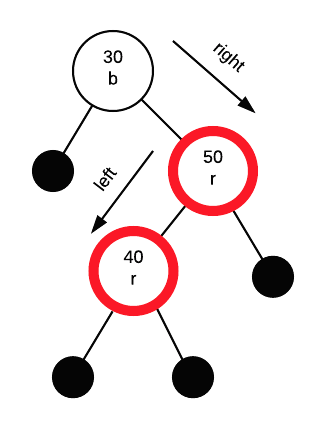

# Research Paper
* Name: Jiawei Zhou
* Semester: Summer 2023
* Topic: Red–black tree
* Link The Repository: https://github.com/jwzhou1/FinalResearchPaper.git

## Introduction
- Provide an introduction to the rest of the paper. 

In the domain of computer science, the significance of data structures cannot be overstated when it comes to effectively organizing and managing extensive volumes of data. Within the wide spectrum of available data structures, Red-Black Trees emerge as a sophisticated and highly efficient solution for maintaining ordered data while guaranteeing balanced performance. In this final research paper, we will delve into the complexities of Red-Black Trees, their role in addressing fundamental problems, and embark on an intriguing journey through their historical evolution.

Red-Black Trees are a type of self-balancing binary search trees (BSTs) that offer a systematic and flexible approach to organizing data, especially in scenarios involving dynamic insertion and deletion operations. These trees enhance the standard BST structure by incorporating additional properties and operations to maintain balance, resulting in efficient and predictable runtime complexity.

The most notable characteristic of Red-Black Trees is the color assigned to each of their nodes, which can be either red or black. This color scheme plays a crucial role in achieving a balanced tree structure in terms of depth and height, thereby ensuring efficient search, insertion, and deletion operations. Through adherence to specific rules and constraints, Red-Black Trees maintain a balance that guarantees a worst-case time complexity of O(log n) for fundamental operations.

Example of a red–black tree:  

Figure 1: A red–black tree with explicit NIL leaves [1]

  

Figure 2: A red–black tree with implicit left and right docking points [1]  

Red-Black Trees are designed to address the challenge of maintaining a balanced binary search tree while accommodating dynamic updates. Although standard binary search trees offer efficient search, insertion, and deletion operations on average, their worst-case time complexity can deteriorate to O(n) when the tree becomes highly unbalanced. This imbalance typically occurs when elements are inserted or deleted in a sorted order, resulting in a skewed tree.

Red-Black Trees mitigate this issue by implementing a set of rules and operations that ensure structural balance. These trees guarantee that the longest path from the root to any leaf node is no more than twice as long as the shortest path, thus promoting a balanced and effective search tree for various applications.

The concept of Red-Black Trees emerged from the pioneering work of Rudolf Bayer, who introduced this tree structure in 1972 during his Ph.D. studies at the University of Karlsruhe, Germany. Bayer's innovative idea involved annotating nodes with color information to achieve balance, giving birth to the red-black paradigm. [2]

Building upon Bayer's initial concept, he collaborated with his colleague Volker Günter and published a seminal paper in 1978 titled "Symmetric Binary B-Trees: Data Structure and Maintenance Algorithms." This influential publication provided a comprehensive exploration of red-black trees, delving into the intricate details of maintaining the tree's balance. The paper outlined the rules for ensuring the correct coloring and structural properties of red-black trees, along with efficient algorithms for performing insertion and deletion operations.

Since their inception, Red-Black Trees have gained widespread recognition and adoption within the realms of computer science and software engineering. They have become integral components of numerous programming languages and libraries, serving as the fundamental building blocks for various essential operations such as associative arrays, ordered sets, and dictionaries.

Red-Black Trees, as a foundational data structure in computer science, offer an elegant and efficient solution to the challenge of maintaining balanced binary search trees. By employing a clever color-coding scheme and adhering to specific rules, these trees provide fast search, insertion, and deletion operations. They exhibit a guaranteed worst-case time complexity of O(log n), ensuring reliable performance even for large datasets. The historical significance of Red-Black Trees, stemming from the groundbreaking work of Rudolf Bayer and Volker Günter, has solidified their position as a cornerstone in the field of algorithms and data structures.

Through their balanced efficiency, Red-Black Trees continue to empower developers in effectively managing and organizing data for a wide range of applications. Their elegant design and practicality have made them an indispensable tool for efficient and reliable data storage and retrieval. As the field of computer science advances, Red-Black Trees maintain their relevance and remain a crucial resource for optimizing algorithmic performance and data management in various domains.  

In this comprehensive study, we embark on an exploration to gain a deep understanding of Red-Black Trees, uncovering their construction, maintenance, and the theoretical principles that underpin their exceptional properties. Our investigation will extensively cover balancing algorithms and intricacies like color propagation, essential for comprehending how these trees maintain their balance.

The objectives of this research are diverse. Our primary aim is to provide readers with a comprehensive understanding of the fundamental principles and unique characteristics that distinguish Red-Black Trees from other balanced binary search trees. We will thoroughly examine the rules governing their construction and explore how the insertion and deletion processes dynamically adapt to maintain balance.

As part of our investigation, we will conduct a comparative analysis of Red-Black Trees against other balancing techniques, critically assessing their strengths and weaknesses. By contrasting them with alternatives such as AVL Trees, B-Trees, and Splay Trees, our study aims to offer valuable insights to aid readers in selecting the most suitable data structure for specific use cases.

In conclusion, this study seeks to be a comprehensive and informative resource for students, researchers, and professionals keen on exploring the elegance and efficiency of Red-Black Trees. By grasping the inner workings of these trees, we can leverage their power to develop faster, more reliable algorithms and applications that will undoubtedly shape the future of computer science and software engineering.

## Analysis of Algorithm/Datastructure
A Red-Black Tree is a type of self-balancing binary search tree that ensures the tree remains approximately balanced during insertions and deletions. It achieves this balance through a set of rules and operations that maintain certain properties of the tree. These properties include [3]:

1. The tree is a self-balancing Binary Search Tree, which means it automatically maintains balance through rotations or node recoloring.

2. This tree data structure goes by the name "Red-Black tree" since each node is either Red or Black. A unique bit is used to represent the color of each node - 0 for black and 1 for red. Apart from this, nodes in the tree store typical binary tree information like data, left pointer, and right pointer.

3. The root node of the Red-Black tree is always colored black.

4. Unlike regular binary trees where leaf nodes have no children, in the Red-Black tree, nodes without children are considered internal nodes. These internal nodes are connected to special NIL nodes, which are always colored black, and these NIL nodes act as the leaf nodes in the Red-Black tree.

5. A crucial property of the Red-Black tree is that if a node is colored red, then its children must be colored black. Essentially, there are no red-red parent-child relationships allowed.

6. Another important property of the Red-Black tree is that every path from a node to any of its descendant NIL nodes should have the same number of black nodes. This ensures that the tree remains balanced and guarantees logarithmic height.

While every AVL tree can be transformed into a Red-Black tree by assigning each node a color, it's important to note that not every Red-Black tree can be considered an AVL tree. The reason for this distinction lies in their respective balancing properties. AVL trees adhere to strict height-balance conditions, ensuring that the height difference between the left and right subtrees of any node is no more than one. On the other hand, Red-Black trees, while self-balancing, do not enforce complete height-balance and may have a greater height difference between subtrees. As a result, a Red-Black tree might not meet the criteria to be classified as an AVL tree.

Let's begin with a comprehensive overview of the time and space complexity of Red-Black Tree operations[4]:
| OPERATION | AVERAGE CASE | WORST CASE |
|-----------|--------------|------------|
| Space     | $O(n)$       | $O(n)$     |
| Search    | $O(log n)$   | $O(log n)$ |
| Insert    | $O(log n)$   | $O(log n)$ |
| Delete    | $O(log n)$   | $O(log n)$ |

**Search in Red-Black tree**

A Red-Black tree takes O(log n) time for search because it is a type of self-balancing binary search tree. The Red-Black tree maintains its balance by enforcing certain properties that ensure its height remains logarithmic with respect to the number of nodes (n) in the tree.

Because of properties of red-black trees, the longest path from the root to any leaf node cannot be more than twice the length of the shortest path from the root to any leaf node. This guarantees that the tree is balanced, and the height of the tree remains logarithmic with respect to the number of nodes (O(log n)).

As a result, the search operation in a Red-Black tree takes O(log n) time complexity, which is very efficient for large datasets, making it a preferred data structure for various applications.

Since the Red-Black tree is a type of binary search tree, the search operation in a Red-Black tree is analogous to the search operation in a binary search tree.

To better grasp the search operation in a Red-Black tree, let's consider the below binary search tree from Javatpoint.com [3]:

In the above tree, if we want to search for the value 80, the search process proceeds as follows:

1. We start by comparing 80 with the root node, which is 10. Since 80 is greater than 10, we continue the search on the right subtree.
2. Next, we compare 80 with the node 15. As 80 is greater than 15, we move to the right child of 15, which is 20.
3. We reach the leaf node 20, but since 20 is not equal to 80, the search concludes, indicating that the element 80 is not found in the tree.

Throughout each step of the search operation, the tree effectively divides in half. As a result, the Binary Search Tree (BST) structure enables the search to take O(log n) time complexity, making it an efficient search operation for balanced trees like the one shown above.

**Insertion in Red-Black tree**

A Red-Black tree takes O(log n) time for insertion because it is designed as a self-balancing binary search tree. The Red-Black tree maintains its balanced structure through a series of color adjustments and rotations during the insertion process.

When inserting a new node into the Red-Black tree, it starts as an ordinary binary search tree insertion. The new node is initially colored as red to preserve the other properties of the Red-Black tree. Once the node is inserted, a series of color adjustments and rotations are performed to restore and maintain the Red-Black tree properties.

Firstly, below are the rules used to construct a Red-Black tree [3]:

1. If the tree is empty, a new node is created as the root node with a black color.
2. If the tree is not empty, a new node is added as a leaf node with a red color.
3. If the parent of a new node is black, no further adjustments are needed, and the insertion process exits.
4. If the parent of a new node is red, the color of the parent's sibling is checked:  
   a. If the sibling's color is black, rotations and recoloring are performed to maintain the Red-Black tree properties.  
   b. If the sibling's color is red, the node is recolored. Additionally, if the parent's parent of the new node is not the root node, the process is repeated by recoloring and rechecking the node until the Red-Black tree properties are satisfied.

Let's explore the insertion process in the Red-Black tree using the following elements from javatpoint.com [3]:

**10, 18, 7, 15, 16, 30, 25, 40, 60**

**Step 1:** At the beginning, the tree is empty, and we introduce a new node with a value of 10. Since this is the first node in the tree, it becomes the root node. As mentioned earlier, the root node must always be colored black, as illustrated below:

**Step 2:** The subsequent node is 18. Since 18 is greater than 10, it will be placed to the right of 10, as demonstrated below:

Following the second rule of the Red-Black tree, when the tree is not empty, the newly created node will have the color Red. Therefore, node 18 is given the Red color.

Next, we proceed to check the third rule of the Red-Black tree, which requires that the parent of the new node must be black. In the previous figure, it can be observed that the parent of node 18 is indeed black, thereby confirming that the tree maintains the properties of a valid Red-Black tree.  

**Step 3:** Moving forward, we introduce a new node with a value of 7 and assign it the color Red. Since 7 is less than 10, it is placed to the left of node 10, as illustrated below:

Now, let's proceed to validate the third rule of the Red-Black tree, which ensures that the parent of the new node is black. Upon observation, we can confirm that the parent of node 7 is indeed black in color, thus adhering to the properties of the Red-Black tree.

**Step 4:** Moving on to the next element, which is 15, we find that it is greater than 10 but less than 18. Consequently, a new node is created to the left of node 18. As per the Red-Black tree rules, the node 15 will be colored Red since the tree is not empty.

The preceding tree exhibits a violation of the Red-Black tree property due to the presence of a Red-red parent-child relationship. To rectify this, we need to apply specific rules to maintain a valid Red-Black tree structure.

Rule 4 of Red-Black trees states that if the new node's parent is Red, we must examine the color of the parent's sibling node. In this case, the new node is node 15, its parent is node 18, and the sibling of the parent node is node 7. Since the color of the parent's sibling (node 7) is Red, we apply Rule 4a. According to Rule 4a, we need to recolor both the parent and the parent's sibling node. Consequently, both nodes 7 and 18 will be recolored, resulting in the updated figure below:

Another crucial check we need to perform is whether the parent's parent of the new node is the root node or not. Upon observation in the above figure, it is evident that the parent's parent of the new node (node 15) is indeed the root node (node 10). As a result, there is no need to recolor the root node in this scenario.

**Step 5:** Proceeding with the next element, which is 16, we observe that it is greater than 10, but less than 18 and greater than 15. Consequently, node 16 will be placed to the right of node 15. As the tree is not empty, node 16 will be colored Red.

In the previous figure, it is evident that a violation of the parent-child relationship exists due to the presence of a red-red parent-child relationship. To address this issue and create a valid Red-Black tree, we need to apply certain rules. Since the new node's parent is red and the parent has no sibling, we will apply rule 4a, which involves performing rotations and recoloring on the tree.

As node 16 is to the right of node 15, and the parent of node 15 is node 18, we encounter an LR (Left-Right) relationship, which requires two rotations. Initially, a left rotation is performed on nodes 15 and 16, resulting in node 16 moving upward, and node 15 moving downward. The tree after the left rotation appears as shown below:  

In the previous figure, we can observe that there exists an LL (Left-Left) relationship. Due to the Red-red conflict in the tree, we need to perform a right rotation to resolve it. After executing the right rotation, the median element, which is node 16, will become the root node. Consequently, nodes 15 and 18 will be placed as the left child and right child, respectively, as illustrated in the following figure:

Following the rotation, both node 16 and node 18 will undergo recoloring. Node 16, which is currently red, will change to black, while node 18, which is black, will change to red. The resulting tree structure is illustrated in the figure below:

**Step 6:** Moving forward, the next element to insert is 30. Node 30 will be added to the right of node 18. Since the tree is not empty, the color of node 30 will be red.

The new node's parent and its parent's sibling are both initially Red in color, leading to the application of rule 4b. Rule 4b solely involves recoloring without any need for rotations. Consequently, both the parent (node 18) and its sibling (node 15) change their color to black, as depicted in the image below.

Additionally, we need to verify the status of the parent's parent of the new node to determine if it is the root node. In this case, the parent's parent of the new node (node 30) is node 16, and node 16 is not the root node. Consequently, we will reassign the color of node 16 to Red. The parent of node 16 is node 10, and it is not Red in color, thus ensuring there is no Red-red conflict in the tree structure.

**Step 7:** Let's now insert the next element, 25, into the tree. Considering the values of existing nodes, we find that 25 falls between 10, 16, 18, and 30. Therefore, it will be placed to the left of node 30. Since the tree is not empty, we'll mark node 25 as Red.

Here comes the tricky part, a Red-red conflict arises since the parent of the newly inserted node is also Red.

To resolve this, we apply rule 4a, which involves both rotation and recoloring. Since there's no parent's sibling in this scenario, we proceed with the rotations first.

Given that the newly inserted node is on the left of its parent, and the parent node is on the right of its parent, a "RL" relationship is formed. As a result, we perform a right rotation, which moves node 25 upwards, while node 30 goes downwards. The figure below illustrates this transformation.

Following the initial rotation, an RR relationship is established, prompting a subsequent left rotation. As a result of the right rotation, the central element, 25, assumes the position of the root node. Node 30 will be situated to the right of 25, while node 18 will find its place on the left side of node 25.

Now, we proceed with the recoloring step. Nodes 25 and 18 will undergo recoloring. Specifically, node 25 will change its color to black, while node 18 will assume a red color.

**Step 8:** Moving on to the next element, which is 40. Considering the values of existing nodes (10, 16, 18, 25, and 30), we find that 40 is greater than all of them. Therefore, node 40 will be placed to the right of node 30. As the tree is not empty, node 40 will be marked as Red in color.

However, we encounter a Red-red conflict between nodes 40 and 30. To address this situation, we will apply rule 4b to resolve the conflict.

As the new node's parent and its parent's sibling are both Red in color, recoloring is required. Both nodes change their color to black, as illustrated in the image below.

Following the recoloring, we need to check the parent's parent of the new node, which is node 25 in this case. Since node 25 is not the root node, recoloring will be performed, turning node 25 into Red.

Now, a red-red conflict arises between nodes 25 and 16. Node 25 will now be treated as the new node. As the parent of node 25 is red, and the parent's sibling is black, rule 4a comes into play. Considering that 25 is on the right of node 16, and node 16 is on the right of its parent, an RR relationship is established. Consequently, a left rotation is performed to address this situation. After the left rotation, the median element, 16, becomes the root node, as depicted in the figure below.

Following the rotation, recoloring is carried out on nodes 16 and 10. The color of node 10 becomes Red, while the color of node 16 changes to Black, as illustrated in the figure below.

 

**Step 9:** Now, let's proceed with the insertion of the next element, 60. Considering the existing values in the tree (16, 25, 30, 40), we find that 60 is greater than all of them. Therefore, node 60 will be placed to the right of node 40. As the tree is not empty, the color of node 60 will be Red.

Upon observing the tree, we can see that a Red-red conflict arises. The parent node is Red in color, and there is no parent's sibling present in the tree. As a result, we will apply rule 4a. The first rotation to be performed will be a left rotation, as there is an RR relationship between the nodes.

Upon performing the left rotation, node 40 moves upwards, and node 30 moves downwards, as depicted in the figure below:

After the rotation, recoloring is carried out on nodes 30 and 40. The color of node 30 changes to Red, while the color of node 40 changes to Black, as illustrated in the figure below.

The tree depicted above adheres to all the properties of a Red-Black tree, making it a valid Red-Black tree. This example has been sourced from javatpoint.com [3].

**Deletion in Red-Black tree**  

A Red-Black tree takes O(log n) time for deletion because it is a self-balancing binary search tree that maintains its balanced structure during the deletion process. When a node is deleted from the Red-Black tree, a series of color adjustments and rotations are performed to restore and preserve the Red-Black tree properties.

The deletion process in a Red-Black tree begins with a standard binary search tree deletion. Once the node is removed from the tree, the tree's properties may be violated, specifically the properties related to color balance and black height. To maintain these properties, a set of restructuring operations, including color adjustments and rotations, are performed.

Now, let's explore the process of deleting a specific node from the Red-Black tree. We will be employing the following rules to achieve the deletion from javatpoint.com [3]:

**Step 1:** Initially, we begin the deletion process by applying the Binary Search Tree (BST) rules.  
**Step 2:**  
**Case 1:** If the node to be deleted is Red, we can directly remove it from the tree.  

To illustrate Case 1, let's consider an example. Let's say we want to delete node 30 from the following tree:  

Initially, with the address of the root node in hand, we will apply the Binary Search Tree (BST) approach to search for the desired node, which is 30 in this case. Following the comparison, we find that 30 is greater than both 10 and 20, indicating that 30 is the right child of node 20. As node 30 is a Red leaf node, we can safely delete it from the tree.

Now, let's explore the process of deleting an internal node that has only one child. The first step involves replacing the value of the internal node with the value of its child node. Subsequently, we can proceed to delete the child node from the tree.

**Let's consider another example where we aim to delete the internal node, node 20.**

In the scenario where we need to remove an internal node, such as node 20, we cannot directly delete it. Instead, we can replace the value of node 20 with another value. Since node 20 is situated to the right of the root node and possesses only one child, which is node 30, we will update the value of node 20 to 30 while keeping its color unchanged (Black). Subsequently, we can safely delete node 20 (which now acts as a leaf node) from the tree.

When we encounter the scenario of deleting an internal node with two child nodes, we must choose between two approaches for replacing the value of the internal node (either left subtree or right subtree):

1. **Inorder predecessor**: We will replace the value with the largest value present in the left subtree.
2. **Inorder successor**: We will replace the value with the smallest value present in the right subtree.

Let’s say we want to remove the node with the value 30 from the following tree:  

  

Node 30 is located to the right of the root node. In this situation, we will use the inorder successor method. The smallest value in the right subtree is 38, so we will replace the value of 30 with 38 while keeping the node itself red. After replacing the value, we will remove the leaf node, which is 30, from the tree. Since node 30 is a red-colored leaf node, we can simply delete it without having to perform any rotations or recoloring.  

  

**Case 2:** In the event that the root node is also double black, we can easily remove the double black and change it to a single black node.

**Case 3:** If the sibling of the double black node is black and both of its children are also black:
   - Remove the double black node
   - Add its color to the parent(P) node. 

   1. If the parent node is red, it will become black. 
   2. If the parent node is black, it will become double black. 
   - The sibling of the double black node will change to red. 
   - If a double black situation still arises, we can apply other cases to resolve it.

To better understand this case, let’s look at an example. Imagine we want to remove the node with the value 15 from the below tree:  

  

We cannot just remove node 15 from the tree since it is colored black. Node 15 has two nil children, so we replace the value of 15 with a nil value. Since both node 15 and the nil node are black, the node becomes double black after the replacement, as shown in the figure below:  

  

Upon examining the tree above, we can discern that the sibling of the double black node is black, and its children are nil, which are also black. Since the sibling and its children are all black, it is unable to transfer its black color to any of them. The parent node of the double black node is red, so the double black node imparts its black color to its parent. As a result, the color of node 20 changes to black, while the nil node becomes a single black, as depicted in the figure below:

  

After adding its color to the parent node, the sibling of the double black node, which is node 30, changes to red, as illustrated in the figure below. 

  

Thus, we can see that the issue of the double black node no longer exists and that it remains a Red-Black tree by examining the above tree.

**Case 4:** Handling the situation when the sibling of the double black node is Red.

To resolve this scenario, the following steps should be taken:

1. Exchange the colors of the parent node and its sibling.
2. Perform a rotation on the parent node in the direction of the double black node.
3. Reapply the cases to ensure the Red-Black tree properties are maintained.

For better comprehension, let's illustrate this case with a practical example:

Let's consider a Red-Black tree and the node 15 that we want to delete.

  

In the beginning, the value 15 is substituted with a nil value, resulting in the node becoming double black. Given that the sibling of the double black node is Red, the color of node 20 is modified to Red, and the color of node 30 is altered to Black.

After the color swapping process, the rotation to address the double black situation will take place. Node 30 will ascend, while node 20 will descend, as illustrated in the following diagram.

  

In the above tree, the double black situation remains unresolved. It meets the criteria of case 3, where the double black's sibling is black, and both its children are black. To address this situation, we first remove the double black status from the node and assign the black color to its parent node. Consequently, the color of the double black's sibling, i.e., node 25, changes to Red, as illustrated in the following figure.

  

In the above tree diagram, it is evident that the double black scenario has been effectively resolved. Furthermore, the tree satisfies all the essential properties of a Red-Black tree.

**Case 5:** When the sibling of the double black node is black, and the sibling's child, which is far from the double black node, is black, but the nearer child to the double black node is red.

1. Exchange the colors of the double black's sibling and the sibling child that is closer to the double black node.
2. Rotate the sibling node in the opposite direction of the double black node.
3. Proceed to handle the scenario as per case 6.

Suppose we intend to delete the node 1 in the following tree.

  

Initially, we substitute the value 1 with a nil value, resulting in the node becoming double black, as both the nodes, i.e., 1 and nil, are black. This situation aligns with case 3, which states that if the double black's sibling is black and both its children are black, certain actions are required.

Firstly, we eliminate the double black status from the nil node. Since the parent of the double black node is black, when we add the black color to the parent node, it becomes double black. After this color addition, the double black's sibling changes its color to Red, as depicted below.

  

As seen in the previous illustration, the double black issue persists in the tree. Thus, we need to reapply the relevant cases to resolve it. In this situation, we will apply case 5 since node 30 is the sibling of node 5 and is black in color. Additionally, the child of node 30 that is farther from node 5 is black, and the nearer child to node 5 is Red. 

To handle case 5, we will first swap the colors of node 30 and node 25, resulting in the color of node 30 changing to Red, and the color of node 25 changing to Black, as depicted below.

  

After completing the color swapping between the nodes, the next step is to perform a rotation of the sibling in the opposite direction of the double black node. In this rotation, node 30 will descend, while node 25 will ascend, as illustrated below.  

  

In the above provided tree, it is evident that the double black situation remains unresolved. Therefore, we must proceed with case 6. Before diving into case 6, let's first understand what it entails.

**Case 6:** When the sibling of the double black node is black, and the far child is Red:

1. Swap the colors of the Parent and its sibling node.
2. Rotate the parent node towards the direction of the double black node.
3. Remove the Double black node.
4. Change the Red color to black.

Let's proceed with applying case 6 to resolve the double black situation in the provided example.

In this case, the double black node is node 5, and its sibling is node 25, which is black in color. The far child of the double black node is node 30, and it is Red in color, as illustrated in the figure below: 

 

Initially, we attempt to swap the colors of the Parent node and its sibling. In this particular case, the parent of node 5 is node 10, and the sibling node is node 25. Since the colors of both nodes are black, no swapping will occur in this step.

Next, we proceed to the second step, which involves rotating the parent in the direction of the double black node. After performing the rotation, node 25 will ascend, while node 10 will descend. The resulting tree structure will be as illustrated in the figure below:

 

In the subsequent step, we eliminate the double black status from node 5, and node 5 imparts its black color to the far child, which is node 30. Consequently, the color of node 30 changes to black, as depicted in the figure below:

 

By executing this step, we successfully address the double black situation, ensuring the Red-Black tree properties are preserved.

## Empirical Analysis
- What is the empirical analysis?
- Provide specific examples / data.

## Application
- What is the algorithm/datastructure used for?
- Provide specific examples
- Why is it useful / used in that field area?
- Make sure to provide sources for your information.

## Implementation
- What language did you use?
- What libraries did you use?
- What were the challenges you faced?
- Provide key points of the algorithm/datastructure implementation, discuss the code.
- If you found code in another language, and then implemented in your own language that is fine - but make sure to document that.

## Summary
- Provide a summary of your findings
- What did you learn?

## Reference
[1] Red-black tree. In Wikipedia. Retrieved July 15, 2023, from https://en.wikipedia.org/wiki/Red%E2%80%93black_tree   
[2] Huja, H. Red-Black Tree. Medium. Retrieved July 15, 2023, from https://hardikahuja99.medium.com/red-black-tree-8cf904034a90  
[3] JavaTpoint. Red-Black Tree. Retrieved July 15, 2023, from https://www.javatpoint.com/red-black-tree  
[4] OpenGenus IQ. Time and Space Complexity of Red-Black Tree. Retrieved July 15, 2023, from https://iq.opengenus.org/time-and-space-complexity-of-red-black-tree/  