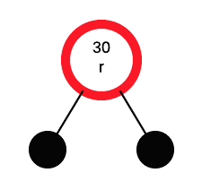
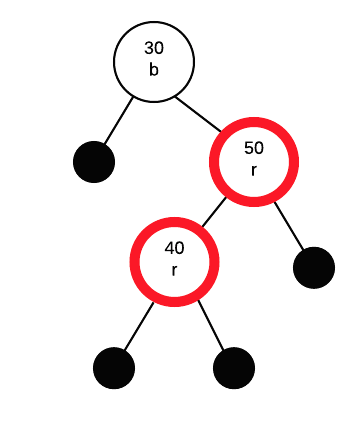

# Research Paper
* Name: Jiawei Zhou
* Semester: Summer 2023
* Topic: Analyzing the Red–black tree
* Link The Repository: https://github.com/jwzhou1/FinalResearchPaper.git


## Introduction
The significance of Red-Black Trees within the field of computer science cannot be understated. These data structures offer an immensely efficient solution for managing ordered data while ensuring balanced performance. Their importance is evident not only in academic circles but also in the corporate world, where major companies frequently include Red-Black Trees as a staple in their interview processes. This research paper seeks to provide a comprehensive examination of Red-Black Trees, shedding light on their intricacies, their pivotal role in addressing fundamental computational problems, and tracing their historical evolution. Furthermore, I would like to express my heartfelt gratitude to our Professor Albert Lionelle for providing this invaluable opportunity to delve into the realm of advanced data structures.

Red-Black Tree is a self-balancing binary search tree that maintains a balance between its left and right subtrees. The tree nodes are augmented with an extra attribute, color, which can either be red or black. The primary goal of the Red-Black Tree is to ensure that the tree remains approximately balanced, which helps in maintaining efficient search, insertion, and deletion operations with a logarithmic time complexity.

The Red-Black Tree follows five essential properties:

1. Every node is colored either red or black.
2. The root node is always black.
3. Red nodes cannot have red children (i.e., no two consecutive red nodes can exist on any path).
4. Every path from the root to a leaf must have the same number of black nodes (this is known as the black-height property).
5. Null leaf nodes (external nodes) are considered black.

The balancing of the tree is achieved through a set of operations that preserve these properties during insertions and deletions. When a new node is inserted into the tree, it is initially colored red to ensure that the black-height property is maintained, and it may lead to a violation of the red-black properties. To restore the properties, a series of rotations and color flips are performed along the path from the inserted node to the root.

The most crucial aspect of maintaining the balance is the process of "rebalancing" after an insertion or deletion operation. If a red node's parent is also red, it violates the property of red nodes not having red children. To resolve this, we perform rotations and recoloring of nodes to ensure that no consecutive red nodes exist. The tree rotations help adjust the structure of the tree while maintaining the binary search tree property. There are two types of rotations: left rotation and right rotation.

During the rebalancing process, the tree might go through a series of rotations, but it guarantees that the height of the tree remains logarithmic, and all the Red-Black Tree properties are preserved. Consequently, the search, insert, and delete operations have a time complexity of $O(log n)$, making Red-Black Trees an efficient and balanced data structure for various applications.

Example of a red–black tree:  


Figure 1: A red–black tree with explicit NIL leaves [1]

  

Figure 2: A red–black tree with implicit left and right docking points [1]  

Red-Black Trees were developed to tackle the challenge of maintaining a balanced binary search tree while handling dynamic updates. The regular binary search trees perform well with search, insertion, and deletion operations on average. However, in the worst-case scenario, their time complexity can deteriorate to $O(n)$ when the tree becomes highly unbalanced. This typically happens when elements are inserted or deleted in a sorted order, causing the tree to skew.

To address this imbalance issue, Red-Black Trees employ a set of rules and operations to ensure structural balance. By following these rules, the trees guarantee that the longest path from the root to any leaf node is no more than twice as long as the shortest path. This property promotes a balanced and efficient search tree suitable for various applications.

Red-Black Trees came into existence through the groundbreaking efforts of Rudolf Bayer back in 1972 when he was pursuing his Ph.D. at the University of Karlsruhe in Germany[2]. Bayer's brilliant concept involved assigning colors to nodes to maintain balance, and this marked the birth of the red-black paradigm[3].

Drawing inspiration from Bayer's concept, Guibas and Sedgewick (1978) [4] developed the red-black tree as a variant of the symmetric binary B-tree. The choice of the color "red" for the tree was influenced by the pleasing color produced by the color laser printer available at Xerox PARC during their research.

In 1993, Arne Andersson [5] introduced the idea of a right-leaning tree to simplify insert and delete operations. Later, in 1999, Chris Okasaki [6] demonstrated how to achieve a purely functional insert operation, dealing with only four unbalanced cases and one default balanced case in the balance function.

Initially, the algorithm had eight unbalanced cases, but in 2001, Cormen et al. (2001) [7] managed to reduce them to six. Additionally, Sedgewick (2008) [8] showed that the insert operation could be implemented in just 46 lines of Java code. Following Andersson's approach, he proposed the left-leaning red-black tree in 2008, further simplifying the insert and delete operations. Originally, Sedgewick allowed nodes with two red children, making his trees more similar to 2-3-4 trees. However, this restriction was later added, making the new trees more akin to 2-3 trees. The updated insert algorithm was further optimized, reducing the code to only 33 lines, significantly shorter than the original 46 lines.

Throughout the history of computer science and software engineering, Red-Black Trees have emerged as highly esteemed and widely adopted data structures. They have become essential components in programming languages and libraries, enabling various crucial operations like associative arrays, ordered sets, and dictionaries.

Red-Black Trees are renowned for their elegant and efficient approach to maintaining balanced binary search trees. Employing a smart color-coding scheme and following specific rules, they deliver rapid search, insertion, and deletion operations with a guaranteed worst-case time complexity of $O(log n)$. The remarkable contributions of Rudolf Bayer have solidified the historical significance of Red-Black Trees as a fundamental cornerstone in the world of algorithms and data structures.

Through harnessing their well-balanced efficiency, Red-Black Trees have provided developers with a powerful means to proficiently handle and organize data across a diverse array of applications. Their practical and ingenious design has established them as an indispensable tool for achieving both efficiency and reliability in data storage and retrieval. As computer science continues to advance, the significance of Red-Black Trees endures, playing a vital role in optimizing algorithmic performance and facilitating efficient data management in various domains.

In this research endeavor, we embark on a comprehensive exploration of Red-Black Trees, delving deep into their construction, maintenance, and the theoretical principles that underlie their exceptional properties. Our aim is to thoroughly cover balancing algorithms and intricacies, including color propagation, to gain a profound understanding of how these trees maintain their crucial balance.

My research endeavors encompass a range of objectives. My primary goal is to present readers with a thorough comprehension of the fundamental principles and distinctive attributes that distinguish Red-Black Trees from other balanced binary search trees. I will delve into the rules governing their construction and investigate how their insertion and deletion processes dynamically adjust to maintain balance.

Furthermore, I plan to conduct a comprehensive analysis, comparing Red-Black Trees against other balancing techniques such as AVL Trees and B-Trees, in order to evaluate their respective strengths and weaknesses. This comparative study will provide valuable insights to help readers select the most appropriate data structure for their specific use cases.

In essence, my study aims to be a comprehensive and insightful resource, catering to students, researchers, and professionals interested in exploring the elegance and efficiency of Red-Black Trees. By gaining a deeper understanding of these trees' inner workings, readers can harness their potential to develop faster, more reliable algorithms and applications, significantly influencing the future of computer science and software engineering.


## Analysis of Algorithm/Datastructure
Let's begin by discussing the fascinating Red-Black Tree, a special type of self-balancing binary search tree that ensures its balance during insertions and deletions. This balance is maintained through a series of rules and operations that uphold specific properties of the tree. These key properties are as follows [9]:

1. The Red-Black Tree is designed as a self-balancing Binary Search Tree, which means it automatically adjusts its structure through rotations or node recoloring to maintain balance.

2. The name "Red-Black tree" stems from the fact that each node is assigned one of two colors: Red or Black. To represent these colors, a single bit is used - 0 for black and 1 for red. Alongside the color information, nodes in the tree store regular binary tree data, such as data values, left and right pointers.

3. Crucially, the root node of the Red-Black tree is always colored black.

4. Unlike typical binary trees, where leaf nodes have no children, the Red-Black tree considers nodes without children as internal nodes. These internal nodes are connected to special NIL nodes, always colored black, which act as the leaf nodes in this tree structure.

5. An important rule in the Red-Black tree is that if a node is colored red, its children must be colored black. This constraint ensures that there are no red-red parent-child relationships in the tree.

6. Another crucial property involves the number of black nodes along any path from a node to any of its descendant NIL nodes. This property guarantees that all paths have an equal number of black nodes, preserving the balanced nature of the tree and ensuring a logarithmic height.

It is important to understand the differences between AVL trees and Red-Black trees in terms of their self-balancing properties. While both are designed to maintain balance in binary search trees, there are significant distinctions between the two.

AVL trees are quite strict in their balancing conditions, ensuring that the height difference between the left and right subtrees of any node is no more than one. This rigorous requirement guarantees a well-balanced tree and leads to faster search operations.

On the other hand, Red-Black trees take a more relaxed approach to balancing. They do self-balance but don't enforce the same level of height-balance as AVL trees do. This means that Red-Black trees can have a greater height difference between subtrees, making them different from AVL trees and not always fulfilling the criteria to be classified as AVL trees. So, while every AVL tree can be converted into a Red-Black tree by assigning colors to nodes, the reverse is not true— not all Red-Black trees can be considered AVL trees due to their distinct balancing properties.


Now, let's delve into a detailed examination of the time and space complexity of Red-Black Tree operations [10]:
| OPERATION | AVERAGE CASE | WORST CASE | BEST CASE  |
|-----------|--------------|------------|------------|
| Space     | $O(n)$       | $O(n)$     | $O(n)$     |
| Search    | $O(log n)$   | $O(log n)$ | $O(log n)$ |
| Insert    | $O(log n)$   | $O(log n)$ | $O(log n)$ |
| Delete    | $O(log n)$   | $O(log n)$ | $O(log n)$ |

Let's compare the Red-Black Tree with some similar data structures in terms of time and space complexity [11-12]:

**Similar Algorithm Comparison Chart**

| Algorithm             | Operations | Average Time Complexity   | Worst-case Time Complexity   | Space Complexity |
|-----------------------|------------|---------------------------|------------------------------|------------------|
| Red-black tree        | Insert     | $O(log n)$                | $O(log n)$                   | $O(n)$           |
|                       | Delete     | $O(log n)$                | $O(log n)$                   |                  |
|                       | Search     | $O(log n)$                | $O(log n)$                   |                  |
| Binary Search tree    | Insert     | $O(log n)$                | $O(n)$                       | $O(n)$           |
|                       | Delete     | $O(log n)$                | $O(n)$                       |                  |
|                       | Search     | $O(log n)$                | $O(n)$                       |                  |
| AVL tree              | Insert     | $O(log n)$                | $O(log n)$                   | $O(n)$           |
|                       | Delete     | $O(log n)$                | $O(log n)$                   |                  |
|                       | Search     | $O(log n)$                | $O(log n)$                   |                  |
| B-tree                | Insert     | $O(log n)$                | $O(log n)$                   | $O(n)$           |
|                       | Delete     | $O(log n)$                | $O(log n)$                   |                  |
|                       | Search     | $O(log n)$                | $O(log n)$                   |                  |

1. Binary Search Tree (BST):
   The standard binary search tree has a time complexity of $O(log n)$ for insertion, deletion, and search operations on average. However, in the worst case scenario, the tree can degenerate into a linked list, resulting in a time complexity of $O(n)$. The space complexity of both Red-Black Trees and BSTs is generally $O(n)$, but Red-Black Trees require additional space to store color information, which increases the overhead compared to regular BSTs.

2. AVL Tree (Balanced Binary Search Tree):
   Similar to Red-Black Trees, AVL Trees also offer an average and worst-case time complexity of $O(log n)$ for insertion, deletion, and search operations. The key feature of AVL Trees is their self-balancing property, ensuring that the height difference between subtrees is at most 1. This makes them highly efficient for dynamic datasets. Both AVL Trees and Red-Black Trees have space complexity proportional to the number of nodes (O(n)).

3. B-Trees:
   B-Trees are specifically designed for disk-based data structures, making them suitable for scenarios with large datasets and slow disk access. They have a higher fan-out, meaning each node can contain multiple keys. This allows B-Trees to achieve a time complexity of $O(log n)$ for operations, making them efficient for disk-based storage. However, due to the increased fan-out and multiple keys per node, B-Trees generally require more space per node compared to Red-Black Trees. Nonetheless, the overall space complexity remains $O(n)$.


Different types of binary search trees, including Red-Black Trees, Binary Search Trees (BST), AVL Trees, and B-Trees, offer distinct characteristics that make them suitable for specific scenarios.

BST is the most straightforward among these structures, utilizing a sorted binary tree with each node having at most two children. The left child is always smaller than the parent, and the right child is larger, enabling efficient searching with an average time complexity of $O(log n)$ for balanced trees. However, when unbalanced, BST can lead to skewed trees, degrading performance with a worst-case time complexity of $O(n)$ for searching and insertion. Nevertheless, BSTs are useful for smaller datasets, where maintaining a balanced tree is not a significant challenge, and frequent insertions and deletions are not expected.

AVL Trees are a type of balanced binary search tree, ensuring a balance factor of at most 1 for each node. This guarantees logarithmic search, insertion, and deletion times $O(log n)$. AVL Trees maintain their balance through rotations and restructuring operations, making them efficient for large datasets with frequent updates. Despite this advantage, the AVL Tree requires extra overhead to maintain balance, resulting in slightly slower insert and delete operations compared to Red-Black Trees.

Red-Black Trees are also balanced binary search trees, offering a middle ground between AVL Trees and simple BSTs. They ensure that the longest path from the root to a leaf is no more than twice the shortest path, ensuring a logarithmic time complexity $O(log n)$ for searching, insertion, and deletion operations. Red-Black Trees require fewer rotations and restructuring operations compared to AVL Trees, making them more efficient for scenarios with frequent tree updates while maintaining reasonable balancing. These trees are well-suited for general-purpose data structures, such as implementing associative arrays or sets.

On the other hand, B-Trees are not binary trees but multi-way search trees, specifically designed to optimize disk read and write operations for databases and file systems. With a variable number of keys per node, B-Trees can hold more data in a single node, reducing the tree height and the number of disk accesses during operations. They excel in scenarios with large datasets and operations involving secondary storage, offering efficient logarithmic time complexity $O(log n)$ for searching, insertion, and deletion operations. However, B-Trees may be less efficient in memory-bound scenarios, and their complex structure makes them more challenging to implement and maintain compared to Red-Black Trees for in-memory data structures.

In conclusion, selecting the appropriate binary search tree type depends on the specific requirements of the application. Red-Black Trees are ideal for general-purpose scenarios, providing balanced structures without the additional overhead of AVL Trees. For memory-constrained applications and simpler datasets, Binary Search Trees can be sufficient. AVL Trees shine when a guaranteed balanced structure and frequent updates are critical. On the other hand, B-Trees excel in handling large-scale databases and file systems, optimizing disk access for improved performance.

## Operations of Algorithm/Datastructure
Now, let's explore the Red-Black Tree operations in detail.

**Search in Red-Black tree**

A Red-Black tree takes $O(log n)$ time for search because it is a type of self-balancing binary search tree. The Red-Black tree maintains its balance by enforcing certain properties that ensure its height remains logarithmic with respect to the number of nodes (n) in the tree.

Because of properties of red-black trees, the longest path from the root to any leaf node cannot be more than twice the length of the shortest path from the root to any leaf node. This guarantees that the tree is balanced, and the height of the tree remains logarithmic with respect to the number of nodes (O(log n)).

As a result, the search operation in a Red-Black tree takes $O(log n)$ time complexity, which is very efficient for large datasets, making it a preferred data structure for various applications.

Since the Red-Black tree is a type of binary search tree, the search operation in a Red-Black tree is analogous to the search operation in a binary search tree.

To better grasp the search operation in a Red-Black tree, let's consider the below binary search tree from Javatpoint.com [9]:


In the above tree, if we want to search for the value 80, the search process proceeds as follows:

1. We start by comparing 80 with the root node, which is 10. Since 80 is greater than 10, we continue the search on the right subtree.
2. Next, we compare 80 with the node 15. As 80 is greater than 15, we move to the right child of 15, which is 20.
3. We reach the leaf node 20, but since 20 is not equal to 80, the search concludes, indicating that the element 80 is not found in the tree.

Throughout each step of the search operation, the tree effectively divides in half. As a result, the Binary Search Tree (BST) structure enables the search to take O(log n) time complexity, making it an efficient search operation for balanced trees like the one shown above.


**Insertion in Red-Black tree**

A Red-Black tree takes O(log n) time for insertion because it is designed as a self-balancing binary search tree. The Red-Black tree maintains its balanced structure through a series of color adjustments and rotations during the insertion process.

When inserting a new node into the Red-Black tree, it starts as an ordinary binary search tree insertion. The new node is initially colored as red to preserve the other properties of the Red-Black tree. Once the node is inserted, a series of color adjustments and rotations are performed to restore and maintain the Red-Black tree properties.

Firstly, below are the rules used to construct a Red-Black tree [9]:

1. If the tree is empty, a new node is created as the root node with a black color.
2. If the tree is not empty, a new node is added as a leaf node with a red color.
3. If the parent of a new node is black, no further adjustments are needed, and the insertion process exits.
4. If the parent of a new node is red, the color of the parent's sibling is checked:  
   a. If the sibling's color is black, rotations and recoloring are performed to maintain the Red-Black tree properties.  
   b. If the sibling's color is red, the node is recolored. Additionally, if the parent's parent of the new node is not the root node, the process is repeated by recoloring and rechecking the node until the Red-Black tree properties are satisfied.

Let's explore the insertion process in the Red-Black tree using the following elements from javatpoint.com [9]:

**10, 18, 7, 15, 16, 30, 25**

**Step 1:** At the beginning, the tree is empty, and we introduce a new node with a value of 10. Since this is the first node in the tree, it becomes the root node. As mentioned earlier, the root node must always be colored black, as illustrated below:


**Step 2:** The subsequent node is 18. Since 18 is greater than 10, it will be placed to the right of 10, as demonstrated below:


Following the second rule of the Red-Black tree, when the tree is not empty, the newly created node will have the color Red. Therefore, node 18 is given the Red color.

Next, we proceed to check the third rule of the Red-Black tree, which requires that the parent of the new node must be black. In the previous figure, it can be observed that the parent of node 18 is indeed black, thereby confirming that the tree maintains the properties of a valid Red-Black tree.  

**Step 3:** Moving forward, we introduce a new node with a value of 7 and assign it the color Red. Since 7 is less than 10, it is placed to the left of node 10, as illustrated below:


Now, let's proceed to validate the third rule of the Red-Black tree, which ensures that the parent of the new node is black. Upon observation, we can confirm that the parent of node 7 is indeed black in color, thus adhering to the properties of the Red-Black tree.

**Step 4:** Moving on to the next element, which is 15, we find that it is greater than 10 but less than 18. Consequently, a new node is created to the left of node 18. As per the Red-Black tree rules, the node 15 will be colored Red since the tree is not empty.

The preceding tree exhibits a violation of the Red-Black tree property due to the presence of a Red-red parent-child relationship. To rectify this, we need to apply specific rules to maintain a valid Red-Black tree structure.

Rule 4 of Red-Black trees states that if the new node's parent is Red, we must examine the color of the parent's sibling node. In this case, the new node is node 15, its parent is node 18, and the sibling of the parent node is node 7. Since the color of the parent's sibling (node 7) is Red, we apply Rule 4a. According to Rule 4a, we need to recolor both the parent and the parent's sibling node. Consequently, both nodes 7 and 18 will be recolored, resulting in the updated figure below:


Another crucial check we need to perform is whether the parent's parent of the new node is the root node or not. Upon observation in the above figure, it is evident that the parent's parent of the new node (node 15) is indeed the root node (node 10). As a result, there is no need to recolor the root node in this scenario.

**Step 5:** Proceeding with the next element, which is 16, we observe that it is greater than 10, but less than 18 and greater than 15. Consequently, node 16 will be placed to the right of node 15. As the tree is not empty, node 16 will be colored Red.


In the previous figure, it is evident that a violation of the parent-child relationship exists due to the presence of a red-red parent-child relationship. To address this issue and create a valid Red-Black tree, we need to apply certain rules. Since the new node's parent is red and the parent has no sibling, we will apply rule 4a, which involves performing rotations and recoloring on the tree.

As node 16 is to the right of node 15, and the parent of node 15 is node 18, we encounter an LR (Left-Right) relationship, which requires two rotations. Initially, a left rotation is performed on nodes 15 and 16, resulting in node 16 moving upward, and node 15 moving downward. The tree after the left rotation appears as shown below:  


In the previous figure, we can observe that there exists an LL (Left-Left) relationship. Due to the Red-red conflict in the tree, we need to perform a right rotation to resolve it. After executing the right rotation, the median element, which is node 16, will become the root node. Consequently, nodes 15 and 18 will be placed as the left child and right child, respectively, as illustrated in the following figure:


Following the rotation, both node 16 and node 18 will undergo recoloring. Node 16, which is currently red, will change to black, while node 18, which is black, will change to red. The resulting tree structure is illustrated in the figure below:


**Step 6:** Moving forward, the next element to insert is 30. Node 30 will be added to the right of node 18. Since the tree is not empty, the color of node 30 will be red.


The new node's parent and its parent's sibling are both initially Red in color, leading to the application of rule 4b. Rule 4b solely involves recoloring without any need for rotations. Consequently, both the parent (node 18) and its sibling (node 15) change their color to black, as depicted in the image below.


Additionally, we need to verify the status of the parent's parent of the new node to determine if it is the root node. In this case, the parent's parent of the new node (node 30) is node 16, and node 16 is not the root node. Consequently, we will reassign the color of node 16 to Red. The parent of node 16 is node 10, and it is not Red in color, thus ensuring there is no Red-red conflict in the tree structure.


**Step 7:** Let's now insert the next element, 25, into the tree. Considering the values of existing nodes, we find that 25 falls between 10, 16, 18, and 30. Therefore, it will be placed to the left of node 30. Since the tree is not empty, we'll mark node 25 as Red.

Here comes the tricky part, a Red-red conflict arises since the parent of the newly inserted node is also Red.

To resolve this, we apply rule 4a, which involves both rotation and recoloring. Since there's no parent's sibling in this scenario, we proceed with the rotations first.

Given that the newly inserted node is on the left of its parent, and the parent node is on the right of its parent, a "RL" relationship is formed. As a result, we perform a right rotation, which moves node 25 upwards, while node 30 goes downwards. The figure below illustrates this transformation.


Following the initial rotation, an RR relationship is established, prompting a subsequent left rotation. As a result of the right rotation, the central element, 25, assumes the position of the root node. Node 30 will be situated to the right of 25, while node 18 will find its place on the left side of node 25.


Now, we proceed with the recoloring step. Nodes 25, 18 and 15 will undergo recoloring. Specifically, node 25 and 15 will change its color to black, while node 18 will assume a red color.


The tree depicted above adheres to all the properties of a Red-Black tree, making it a valid Red-Black tree. This example has been sourced from javatpoint.com [9].

Let's explore another insertion example in the Red-Black tree using the following elements from catherine-leung.gitbook [13]:

**30 50 40 20 10**

Let's start with an empty tree. The images presented below represent null nodes (empty subtrees), which are indicated by black circles.


We will now insert the node with a value of 30 into the red-black tree. During the insertion process, all nodes are initially added as red nodes.



When inserting a node into the red-black tree, if the root node turns out to be red, we need to change its color to black to satisfy the red-black tree properties.


Let's proceed with the insertion of a node with a value of 50 into the red-black tree. Since the parent node is black, we can directly insert the new node as a red node without making any further adjustments.


We will now insert a node with a value of 40 into the red-black tree. This new node will be inserted as a red node.



We have two red nodes in a row in the red-black tree. Let's identify the nodes involved:

- P (Parent - Upper red) = 50
- C (Child - Lower red) = 40
- G (Grandparent) = 30
- PS (Parent's Sibling) = Null node to the left of 30

Since the parent's sibling (PS) is black, we need to fix this by performing a rotation. The type of rotation required depends on the configuration of G, P, and C. If the path from G to C is straight (both left or both right), we perform a zigzag (single) rotation. If it is angled (left then right or right then left), we need to do a zigzag (double) rotation.


In this particular scenario, we must perform a zigzag (double) rotation. Let's start by rotating nodes 40 and 50.


After the initial zigzag (double) rotation with nodes 40 and 50, we need to perform another rotation, this time involving nodes 30 and 40. During this rotation, we will also swap the colors of nodes 30 and 40. The zigzag rotation is an additional step that ensures the insertion path follows the same direction.


Once the rotations are completed, we proceed to exchange the colors between the node that has taken over G's spot (40 in this case) and G (30). Consequently, node 40 will become black, and node 30 will become red. This color exchange ensures that the red-black tree properties are maintained after the insertion process.


Let's insert a new node with a value of 20 into the red-black tree. This node will be inserted as a red node, and we will proceed with the necessary adjustments to maintain the red-black tree properties.


We have two red nodes in a row in the red-black tree. Let's identify the nodes involved:

- P (Parent - Upper red) = 30
- C (Child - Lower red) = 20
- G (Grandparent) = 40
- PS (Parent's Sibling) = Null node to the left of 50

Since the parent's sibling (PS) is red, we need to perform an operation called color exchange. We exchange colors between G and its two children (P and PS) to satisfy the red-black tree properties.


Performing the color exchange in this case violates properties of red-black trees, which states that roots must be black. To rectify this, we simply change the color of the root node (G, which is currently 40) to black. This adjustment ensures that all red-black tree properties are upheld without causing any further issues.


Let's insert a new node with a value of 10 into the red-black tree. This node will be inserted as a red node, and we will proceed with the necessary adjustments to maintain the red-black tree properties.


We have two red nodes in a row in the red-black tree. Let's identify the nodes involved:

- P (Parent - Upper red) = 20
- C (Child - Lower red) = 10
- G (Grandparent) = 30
- PS (Parent's Sibling) = Null node to the right of 30

Since the parent's sibling (PS) is black (null nodes are considered black in red-black trees), we need to fix this by performing a rotation. The rotation will always be done with G (30) as the root of the rotation (the A in the rotation diagram).

This time, the path from G to P to C is "left" then "left," so we only need to perform a single rotation. After the rotation, we will swap the colors between G (30) and the node that took G's spot. This adjustment ensures that the red-black tree properties are maintained after the insertion process.


After completing the necessary adjustments and rotations, the final red-black tree structure will look like this:


**Deletion in Red-Black tree**  

A Red-Black tree takes $O(log n)$ time for deletion because it is a self-balancing binary search tree that maintains its balanced structure during the deletion process. When a node is deleted from the Red-Black tree, a series of color adjustments and rotations are performed to restore and preserve the Red-Black tree properties.

The deletion process in a Red-Black tree begins with a standard binary search tree deletion. Once the node is removed from the tree, the tree's properties may be violated, specifically the properties related to color balance and black height. To maintain these properties, a set of restructuring operations, including color adjustments and rotations, are performed.

Now, let's explore the process of deleting a specific node from the Red-Black tree. We will be employing the following steps to achieve the deletion from GeeksforGeeks [14]:

**1.** To delete a node in the Red-Black Tree, we first perform the standard Binary Search Tree (BST) delete operation. This operation results in the deletion of a node that is either a leaf or has only one child. In the case of an internal node, we copy the successor and then recursively call the delete function for the successor. It is important to note that the successor node is always a leaf node or a node with one child. Let's assume that we want to delete node v, and u represents the child that will replace v. If v is a leaf node, then u is set to NULL (considered as Black in terms of color representation).

**2.** In the simple case where either u or v is red, we mark the replaced child as black. This operation does not affect the black height of the tree. It is worth mentioning that both u and v cannot be red simultaneously, as u is the child of v, and having two consecutive red nodes is not permitted in a Red-Black Tree.


**3.** When both u and v are Black:  
**3.1** We color u as "double black." This means that after the standard delete operation in a Red-Black Tree, u takes on the double black color. Our goal now is to convert this double black node back to a single black node, maintaining the Red-Black Tree properties. It is important to mention that if v is a leaf node, then u is set to NULL, and in terms of color representation, NULL is considered to be black. Hence, the deletion of a black leaf node also results in a double black situation.


**3.2** While the current node u is in a double black state and is not the root, the following steps are taken. Let the sibling of the node u be denoted as s.

(a) **If the sibling s is black and at least one of its children is red**, a rotation is performed on s. Let the red child of s be denoted as r. This case can be further divided into four subcases, based on the positions of s and r.

   i. Left-Left Case: In this scenario, s is the left child of its parent, and r is the left child of s, or both children of s are red. This subcase can be visualized as a mirror image of the right-right case.

   ii. Left-Right Case: Here, s is the left child of its parent, and r is the right child of s. This subcase can be envisioned as a mirror image of the right-left case.

   iii. Right-Right Case: In this situation, s is the right child of its parent, and r is the right child of s, or both children of s are red.

   
   
   iv. Right-Left Case: In this scenario, the sibling s is the right child of its parent, and r is the left child of s.

   

(b) If the sibling s is black and both of its children are black, a recoloring is performed, and the process is recursively applied to the parent node if the parent is black.

   

   
   In this case, if the parent was red, there would be no need to recur for the parent; instead, we can simply change its color to black, as combining red and double black results in a single black node.

(c) If the sibling s is red, a rotation is performed to move the old sibling up, followed by recoloring the old sibling and the parent. As a result of this operation, the new sibling becomes black. This transformation mainly converts the tree to a situation with a black sibling (achieved through rotation) and then leads to either case (a) or case (b). This case can be further divided into two subcases:

   i. Left Case: When s is the left child of its parent, a right rotation is applied to the parent node p.

   ii. Right Case: If s is the right child of its parent, a left rotation is performed on the parent node p.

   

   
**3.3** If u is the root, we simply make it a single black node, reducing the black height of the complete tree by 1.


## Empirical Analysis

The code writing can be found in the following files:
* [CountSwapRB.py]  -- test for counting the number of swaps in Red-Black Tree
* [count_red_nodes.py]  -- test for counting the number of red nodes in Red-Black Tree
* [count_black_nodes.py]  -- test for counting the number of black nodes in Red-Black Tree

**You can run `CountSwapRB.py` to replicate the first empirical result**

In my initial empirical investigation, I undertook a study to analyze the behavior of a Red-Black tree data structure while adding nodes from 1 to 30,000. The primary focus was on counting the number of swaps that occurred during this process. Throughout the study, the highest number of swaps observed within this range was recorded as 26. 

To carry out this analysis, I developed a Python program that utilized a Red-Black tree and a recursive approach. The implementation involved a class representing the Red-Black tree structure, with a crucial method called "count_swaps" responsible for tracking the swaps. Additionally, a private method named "_count_swaps_recursive" was used to handle the recursive counting of swaps for each node in the tree.

In this Red-Black tree, nodes are divided into two categories based on their colors: 'RED' and other colors like 'BLACK' or 'NIL.' The goal was to understand the behavior of the tree structure as nodes were added and the impact on the number of swaps during this process.

```
    def count_swaps(self):
        return self.swap_count

    def _count_swaps_recursive(self, node):
        if node == self.nil:
            return 0

        left_swaps = self._count_swaps_recursive(node.left)
        right_swaps = self._count_swaps_recursive(node.right)

        swaps = left_swaps + right_swaps

        if node.color == 'RED':
            swaps += 1

        return swaps

    def count_swaps_in_tree(self):
        return self._count_swaps_recursive(self.root)
```

During my analysis, I set the threshold of the last added nodes to 30,000, as counting the swaps was quite time-consuming, taking over a minute to complete. The chart presented below illustrates the number of swaps in the Red-Black tree. On the X-axis, we have the nodes added, while the Y-axis displays the corresponding number of swaps.


One crucial observation was that in the worst-case scenario, the algorithm required a maximum of 26 swaps to maintain the tree's properties and ensure it remained balanced. This finding highlights the complexity of the insertion process and emphasizes the significance of maintaining the Red-Black tree's integrity.

It's essential to note that the number of swaps during insertion can vary based on the sequence of nodes being added. In this specific case, 26 swaps represented the worst-case scenario. However, in most situations, the number of swaps needed during insertion follows a logarithmic pattern relative to the number of nodes being inserted, ensuring efficient performance.

In my subsequent empirical analysis, I focused on the red nodes in Red-Black Trees. I systematically added nodes from 1 to 30,000 and kept track of the maximum number of red nodes encountered, which turned out to be 26.

To conduct this analysis, I designed a Python program using a Red-Black Tree and implemented the `count_red_nodes` method. This recursive function allows me to traverse the Red-Black Tree, taking a specific `node` as input, and effectively counts the number of red nodes in the subtree rooted at that node. The method's accuracy and efficiency enable a comprehensive examination of the red nodes' distribution within the tree during the insertion process.

```
def count_red_nodes(self, node):
    if node == self.NIL_LEAF:  
        return 0
    red_nodes_left = self.count_red_nodes(node.left) 
    red_nodes_right = self.count_red_nodes(node.right)  
    
    if node.color == 'RED':  
        return 1 + red_nodes_left + red_nodes_right
    else:  
        return red_nodes_left + red_nodes_right
```

In my investigation, I set the latest added nodes to 30,000. The reason for this choice was that the swap counting process was taking well over a minute to finish. The data I collected resulted in a chart that displays the number of red nodes in the Red-Black tree. On the chart, the X-axis shows the total number of nodes in the Red-Black tree, while the Y-axis represents the corresponding count of red nodes. This allowed me to observe and understand the relationship between the tree size and the occurrence of red nodes.


In my third empirical investigation, I delved into the fascinating realm of Red-Black Trees, focusing on their black nodes. The main objective was to track the count of black nodes as new nodes were incrementally added from 1 to 30,000. Throughout this study, I kept meticulous records, and the maximum count of black nodes observed during this process was 29,981.

To carry out this analysis, I developed a Python program featuring a Red-Black Tree and a `count_black_nodes` method. This method, implemented as a recursive function, plays a crucial role in traversing the Red-Black Tree.

The `count_black_nodes` function takes a node as its input and begins by checking if the current node corresponds to a leaf node (NIL_LEAF) in the Red-Black Tree. When it encounters a leaf node, the function returns 0 since there are no black nodes to count in such cases. However, if the current node is not a leaf, the function continues its journey by recursively calling itself for both the left and right child nodes of the current one. This recursive process enables the function to explore the entire tree and accurately count the black nodes in each subtree.

Once the function gathers the black node counts from the left and right subtrees, it then examines the color of the current node. If the node's color is "BLACK," it includes the current node in the count by adding 1 to the sum of the black node counts obtained from the left and right subtrees. On the other hand, if the node's color is "RED," it excludes the current node from the count and simply returns the sum of the black node counts from the left and right subtrees without any additions. By following this approach, the `count_black_nodes` method effectively accounts for the black nodes in the Red-Black Tree.

```
  def count_black_nodes(self, node):
        if node == self.NIL_LEAF:
            return 0

        left_count = self.count_black_nodes(node.left)
        right_count = self.count_black_nodes(node.right)

        if node.color == "BLACK":
            return left_count + right_count + 1
        else:
            return left_count + right_count

```

I also set the last added nodes to 30000 due to the time-consuming nature of counting swaps, which would take over a minute to finish. The chart displays the count of black nodes in the Red-Black tree. On the X-axis, you can see the total number of nodes in the Red-Black tree, while the Y-axis shows the corresponding count of black nodes.


In my empirical analysis, I've chosen to work with Python, which has some factors that influence the results. One significant aspect is Python's automatic memory management through the interpreter's garbage collector. This convenience, while helpful in many cases, does introduce some overhead and can make it challenging to accurately track memory allocations and deallocations during tree operations. Consequently, accurately counting the number of swaps in such scenarios, especially with large tree structures, becomes more difficult.

Moreover, Python's focus on ease of use and developer productivity can lead to higher-level abstractions in data structure implementations. While this is advantageous for writing clear and concise code, it may obscure the low-level details necessary for precisely counting swaps. Certain Python libraries or data structure implementations, for example, may abstract away specific swap operations, making it harder to analyze the exact number of swaps performed during Red-Black Tree operations.

Indeed, the hardware limitation of my computer plays a significant role in the analysis process. As technology advances rapidly, newer hardware and processors with improved capabilities become available. However, my computer hasn't been updated to leverage these advancements, and as a result, it lags behind in terms of processing power and speed.

The slow performance of my computer can have various consequences on the analysis. Firstly, the execution time of Python programs, especially those involving complex tree operations, may be significantly prolonged. With large data structures, such as Red-Black Trees, the computational overhead caused by Python's memory management and the lack of optimized hardware can further exacerbate the delay.

As I try to analyze the number of swaps in the Red-Black Tree, the slow speed of my computer can lead to longer waiting times for each operation, affecting the overall efficiency of the analysis. Additionally, if the data set is substantial, the time taken for computation might become impractical, hindering the ability to explore larger data scenarios.

Moreover, in some cases, the slow performance may even lead to incomplete or interrupted analyses, making it challenging to obtain reliable and conclusive results. This limitation emphasizes the importance of updating hardware regularly to ensure a more accurate and efficient analysis process.

Despite these hardware constraints, I am committed to making the best use of the available resources and Python's capabilities. I might consider optimizing the code further to minimize unnecessary computations and reduce memory overhead. Additionally, parallel processing techniques, if applicable, could be explored to distribute the workload and enhance the performance on my current hardware setup.

Furthermore, I acknowledge that the hardware limitation should be taken into account when interpreting the results. As I draw conclusions from the analysis, it is crucial to bear in mind that the hardware's performance could potentially influence the findings and should be considered a contributing factor.

In the future, I plan to upgrade my computer to a more powerful system to improve the overall efficiency of the analysis process. Until then, I will continue to work diligently, recognizing the challenges posed by hardware constraints and striving to derive valuable insights within these limitations.

Despite the constraints posed by code and hardware limitations, Python still proves to be a valuable language. While it's true that Python's limitations can slightly influence the analysis of swap counts in a Red-Black Tree implementation, the insights gained from such an analysis remain valuable for understanding the data structure's overall performance and behavior within the Python environment.


## Application

Now let's explore various fields and areas where red-black trees are commonly used and why they are preferred for those specific applications:

1. **Dynamic Set Operations with Red-Black Trees:**
Red-black trees serve as a valuable tool for handling dynamic set operations[15], such as element search, insertion, and deletion, while ensuring the data remains balanced. This characteristic guarantees efficient performance, with these operations taking only O(log n) time. As an example, imagine a spell-checker application that utilizes a red-black tree to store a sorted dictionary of words. This allows quick lookups, easy insertion of new words, and removal of incorrect ones, all the while maintaining an efficient and organized dictionary.

2. **Red-Black Trees in Compilers and Symbol Tables:**
The efficiency of red-black trees makes them a popular choice in compilers and interpreters for building and maintaining symbol tables[16]. Symbol tables store information about variables, functions, and other symbols used in a program. The balanced nature of red-black trees ensures swift insertion and retrieval of symbols. For instance, in a programming language compiler, red-black trees can effectively store encountered symbols during the parsing phase, enabling quick access and updates during later stages of compilation.

3. **Red-Black Trees in Operating Systems:**
Red-black trees find practical applications in various operating system components, such as process scheduling, file system management, and memory management[17]. These trees efficiently organize and maintain data structures that require speedy search and insertion operations while maintaining balanced resource allocation. For example, in process scheduling, a red-black tree can manage a ready queue of processes, where nodes represent processes with their respective priorities. This facilitates efficient context switching.

4. **Interval Trees for Overlapping Intervals:**
An interval tree, a specialized form of a red-black tree, efficiently stores intervals of values and is ideal for applications that involve searching for overlapping or intersecting intervals[18]. Consider a calendar application, where an interval tree can manage events based on their start and end times. This allows the application to quickly find overlapping events or retrieve events within a specific time range.

5. **Red-Black Trees for Database Indexing:**
Red-black trees play a crucial role in database indexing, providing balanced search trees that enable rapid data retrieval based on specific attributes or fields[19]. These trees handle insertions and deletions efficiently to maintain the index's balance. In a relational database management system, a red-black tree index can accelerate search operations on a specific column, significantly reducing the time needed to retrieve relevant rows from large tables.

6. **Efficient Network Routing with Red-Black Trees:**
Network routing algorithms benefit from the use of red-black trees for organizing and maintaining routing information efficiently[20]. The balanced property of red-black trees ensures fast updates and queries for routing tables. For instance, in computer networks, red-black trees can support link-state routing protocols like OSPF (Open Shortest Path First) by managing the network's topology information and updating routing table entries for optimal packet forwarding decisions.

7. **Counting and Ranking Operations with Augmented Red-Black Trees:**
Red-black trees can be enhanced to support counting and ranking operations on dynamic sets of elements[21]. This augmentation involves adding extra information to each node, enabling efficient counting or ranking queries. For instance, an e-commerce platform can use an augmented red-black tree to maintain a sorted list of products based on popularity or sales count. The augmentation enables the platform to quickly determine the most popular products or provide ranked product lists to users.


Let's now delve into the advantages and disadvantages of the red-black tree data structure.

**Advantages of Red-Black Tree:**
1. Balanced Structure: Red-black trees maintain a well-balanced tree, ensuring that operations run efficiently and prevent skewed structures.
2. Efficient Search: With a time complexity of $O(log n)$ for search operations, red-black trees are ideal for handling large datasets swiftly.
3. Low Constants: Red-black trees exhibit relatively low constants in various scenarios, leading to efficient performance in practical situations.
4. Dynamic Operations: They support dynamic operations like insertion and deletion efficiently, while keeping the tree balanced.
5. Ease of Implementation: Red-black trees are relatively straightforward to understand and implement, making them accessible to developers.
6. Versatility: These trees find use in various applications, including database indexing, memory management, and network routing, effectively handling ordered and unordered data.

**Disadvantages of Red-Black Tree:**
1. Complexity: Creating a red-black tree from scratch and handling edge cases can be complex; many prefer using standard library implementations.
2. Performance for Specific Scenarios: AVL trees might outperform red-black trees in scenarios where the tree is built once and only read operations are performed.
3. Not Ideal for Disk Storage: B-trees are preferred for storing large data on disks due to their ability to limit disk operations.
4. Inefficient Concurrent Access: When it comes to simultaneous access, red-black trees with locking mechanisms might perform poorly compared to locking skip lists, which offer better concurrent performance.
5. Scalability Challenges: As the number of nodes in the tree increases, managing a red-black tree can become challenging and impact overall performance.
6. Slow Insertions: Insertions in red-black trees can be relatively slower compared to other data structures like AVL trees.
7. Handling Large Datasets: Red-black trees may not be the most efficient choice for dealing with large datasets.
8. Overhead: The self-balancing feature of red-black trees adds overhead to insertion and deletion operations, making them slightly slower compared to non-self-balancing structures.
9. Worst-case Performance: While red-black trees have good average-case performance, their worst-case performance might not be as fast as some other data structures.

Overall, red-black trees have their strengths and weaknesses, and the choice of data structure depends on the specific requirements and use cases at hand.

## Implementation

The code writing can be found in the following files:
* [RBTreeImp.py]  -- implementation of Red-Black Tree in Python

**You can run `RBTreeImp.py` for the Implementation of the Red-Black Tree. You can insert nodes, delete nodes and print the Red-Black Tree in the `RBTreeImp.py` by calling `bst.insert()`, `bst.delete_node()` and `bst.print_tree()` in the main function. My code is inspired from AskPython.com [22].**

When it comes to implementing a Red-Black Tree, Python stands out as an excellent choice for several reasons. Python is a high-level and dynamically-typed language known for its simplicity and rich standard library, making it ideal for developing complex data structures like the Red-Black Tree.

One of Python's major strengths lies in its expressive syntax, which allows developers to write clear and concise code. Given the intricacies involved in maintaining tree balance and color properties, code readability becomes crucial. Python's clean and easily understandable syntax makes implementing Red-Black Tree algorithms a more natural and intuitive process. This not only reduces development time but also enhances code maintainability and fosters better collaboration among team members.

Another advantage of Python is its dynamic typing, which adds flexibility during the implementation process. Dealing with complex data manipulations and recursive operations, as often required in Red-Black Trees, can be more manageable with Python's dynamic typing. Developers can focus on the algorithmic aspects without getting bogged down by low-level data type declarations. This flexibility allows for efficient experimentation and easier adaptation of the code to different use cases.

Furthermore, Python's widespread popularity and strong community support offer access to a wealth of libraries and packages that can enhance Red-Black Tree implementation. Third-party libraries for visualization and debugging can provide valuable insights into the tree's structure and properties during development and testing. Moreover, the extensive Python community offers a plethora of learning resources, tutorials, and documentation, benefiting graduate students and developers in understanding the intricacies of Red-Black Trees and improving their implementation skills.

In my implementation, I only utilize the 'import sys' library, a built-in Python module that provides access to variables and functions used by the interpreter. I employ it to access the sys.stdout.write() function, enabling output printing to the console without adding a newline character.

By leveraging Python's strengths and community resources, my implementation of the Red-Black Tree is poised to be efficient, maintainable, and well-supported.

Let's explore the pseudocode for the implementation of Red-Black trees.

The first operation is insertion, which involves adding a new node to a tree. This is accomplished using the insert method with the following algorithm based on CLRS[23] pseudocode for RB-Insert:
```
   RB-Insert(T,z)
      y = nil[T]
      x = root[T]
      while x != nil[T]
            y = x
            if key[z] < key[x] then
               x = left[x]
            else
               x = right[x]
      p[z] = y
      if y = nil[T]
            root[T] = z
      else
         if key[z] < key[y] then
            left[y] = z
         else
            right[y] = z
      left[z] = nil[T]
      right[z] = nil[T]
      color[z] = RED
      RB-Insert-fixup(T,z)

   Parameters:
   value - is an integer to be inserted
```

Here is the insertion function in Python.  
```
  def insert(self, key):
        node = Node(key)
        node.parent = None
        node.item = key
        node.left = self.TNULL
        node.right = self.TNULL
        node.color = 1
        y = None
        x = self.root
        while x != self.TNULL:
            y = x
            if node.item < x.item:
                x = x.left
            else:
                x = x.right
        node.parent = y
        if y == None:
            self.root = node
        elif node.item < y.item:
            y.left = node
        else:
            y.right = node
        if node.parent == None:
            node.color = 0
            return

        if node.parent.parent == None:
            return

        self.fix_insert(node)
```
Let's explain the above code step by step: 
1. The code starts with defining a method named `insert`, which takes a single parameter `key`, representing the value to be inserted into the red-black tree.
2. A new node is created using the `Node` class, and the `key` value is assigned to the `item` attribute of the node. The `color` attribute is set to 1 (red). `self.TNULL` likely represents a sentinel node (a special node representing NULL/empty leaves) used in the red-black tree implementation.
3. The variables `y` and `x` are initialized to `None` and `self.root`, respectively. `y` will be used to keep track of the parent of the newly inserted node, and `x` is used to traverse the tree to find the correct position for the new node.
4. A while loop is used to find the correct position in the red-black tree for the new node. It compares the value of the new node with the values of the existing nodes in the tree and decides whether to move left or right based on the comparison. The loop terminates when `x` becomes the sentinel node (`self.TNULL`) indicating that the correct position for insertion has been found.
5. After finding the correct position, the parent of the new node is set to `y`.
6. If `y` is `None`, it means the tree was empty, and the new node becomes the root of the tree.
7. Otherwise, if the value of the new node is less than the value of `y`, it means the new node should be placed as the left child of `y`, and it is assigned as such.
8. Otherwise, the new node is placed as the right child of `y`.
9. If the parent of the new node is `None`, it means the new node is the root of the tree and is colored black (`node.color = 0`), and the insertion process is complete. A black root is one of the properties of a red-black tree.
10. If the grandparent of the new node (`node.parent.parent`) is `None`, it means the new node's parent is the root of the tree. Since the parent of the new node is already black (set in the previous step), all the properties of the red-black tree are satisfied, and the insertion process is complete.
11. If neither of the above conditions is met, it means the new node has a grandparent and requires further adjustments to maintain the red-black tree properties. The method `fix_insert(node)` is then called to handle the fix-up operations necessary to maintain the properties of a red-black tree.

Next, we will have the RBInsertFixup method. It is responsible for ensuring that the Red-Black Properties of the tree are preserved after performing an insertion. Typically, this method would be marked as private since it serves as a helper function. I will follow Andrew's pseudocode [24] which will provide two pseudocode descriptions: the first one is more for understanding, while the second one is closer to an implementation.

```
  RB-Insert-fixup(T,z) {
  while(z's parent is Red) {
      set y to be z's uncle
      if uncle y is Red {
               color parent and uncle black
               color grandparent red
               set z to grandparent
      }
      else {  // the uncle is black
              if (zig zag) { // make it a zig zig
                             set z to parent
                             rotate to zig zig
                           }
              // rotate the zig zig and finish
              color parent of z black
              color grandparent of z red
              rotate grand parent of z
           }
   } // end while
  color root black
 }

  Low-level Pseudo-code for RB-Insert-fixup
  RB-Insert-fixup(T,z)
  while color[p[z]] = RED {
    if p[z] == left[p[p[z]]] {
         y = right[p[p[z]]]
         if color[y] = RED {
             color[p[z]] = BLACK
             color[y] = BLACK
             color[p[p[z]]] = RED
             z = p[p[z]]
         }
         else {
             if z = right[p[z]] {
                  z = p[z]
                  LEFT-Rotate(T,z)
             }
             color[p[z]] = BLACK
             color[p[p[z]]] = RED
             RIGHT-Rotate(T,p[p[z]])
         }
    }
    else {
         y = left[p[p[z]]]
         if color[y] = RED {
             color[p[z]] = BLACK
             color[y] = BLACK
             color[p[p[z]]] = RED
             z = p[p[z]]
         }
         else
             {
             if z = left[p[z]] {
                  z = p[z]
                  RIGHT-Rotate(T,z)
             }
             color[p[z]] = BLACK
             color[p[p[z]]] = RED
             LEFT-Rotate(T,p[p[z]])
         }
    }
    color[root[T]] = BLACK
  }
  
Parameters:
z - is the new node
```

Here is the RBInsertFixup function in Python.  
```
    def fix_insert(self, k):
        while k.parent.color == 1:
            if k.parent == k.parent.parent.right:
                u = k.parent.parent.left
                if u.color == 1:
                    u.color = 0
                    k.parent.color = 0
                    k.parent.parent.color = 1
                    k = k.parent.parent
                else:
                    if k == k.parent.left:
                        k = k.parent
                        self.right_rotate(k)
                    k.parent.color = 0
                    k.parent.parent.color = 1
                    self.left_rotate(k.parent.parent)
            else:
                u = k.parent.parent.right

                if u.color == 1:
                    u.color = 0
                    k.parent.color = 0
                    k.parent.parent.color = 1
                    k = k.parent.parent
                else:
                    if k == k.parent.right:
                        k = k.parent
                        self.left_rotate(k)
                    k.parent.color = 0
                    k.parent.parent.color = 1
                    self.right_rotate(k.parent.parent)
            if k == self.root:
                break
        self.root.color = 0
```

Let's explain the above code step by step:  
1. The method `fix_insert` takes a single parameter `k`, which represents the newly inserted node that may cause violations in the red-black tree properties.
2. The method uses a `while` loop that continues as long as the parent of node `k` is red (color == 1). This indicates a violation of the red-black tree property that no red node can have a red parent.
3. The code checks whether the parent of node `k` is the right child of its grandparent. This check is to determine whether `k`'s parent is a left child or a right child in its grandparent's subtree.
4. If `k`'s parent is a right child, the code assigns `u` to be the left sibling of `k`'s parent (i.e., `k`'s uncle).
5. If the uncle `u` is red (color == 1), the code performs a series of recoloring operations. The recoloring aims to "push down" the black color to the grandparent and make the parent and uncle black, while the grandparent becomes red. This recoloring allows the fix-up process to move up the tree towards the root to check for further violations.
6. After recoloring, the `k` pointer moves up the tree to the grandparent, as it has now become red due to the recoloring of its child nodes. The loop continues to check if the parent of `k` is red and if the loop should proceed.
7. If the uncle `u` is black (color == 0), the code performs rotations to balance the tree and satisfy the red-black tree properties. The specific rotation depends on the position of `k` and its parent in the grandparent's subtree.
8. If `k` is the left child of its parent and its parent is the right child of the grandparent, a right rotation is performed on the parent to "flip" the subtree and make it a left-left case.
9. After the rotation, the color of the parent and grandparent is adjusted to maintain the properties of the red-black tree.
10. If `k` is the right child of its parent and its parent is the left child of the grandparent, a left rotation is performed on the parent to "flip" the subtree and make it a right-right case.
11. After the rotation, the color of the parent and grandparent is adjusted as before.
12. The loop continues, and the process repeats until the parent of `k` is no longer red or until the root is reached.
13. Finally, the color of the root node is set to black (color == 0), as one of the properties of a red-black tree is that the root must always be black.
Overall, this `fix_insert` method ensures that after inserting a new node into a red-black tree, the tree remains balanced and satisfies all the properties of a red-black tree.


The second operation is deletion. Firstly, we need the `RB-TRANSPLANT` function to handle the replacement of a subtree rooted at node u with a subtree rooted at node v. This function is essential during node deletion in a red-black tree.

The purpose of the RB-TRANSPLANT function is to maintain the integrity of the tree structure and the parent-child relationships after removing a node during the deletion process. The function helps ensure that the red-black tree properties are preserved after a node is removed. Here is the pseudocode for the `RB-TRANSPLANT` function [23].
```
RB-TRANSPLANT(T,u,v)

if u.p == T.nil
	T.root = v
else if u == u.p.left
	u.p.left = v
else
	u.p.right = v
v.p = u.p
```
Here is the `RB-TRANSPLANT` function in Python.  
```
 def __rb_transplant(self, u, v):
        if u.parent == None:
            self.root = v
        elif u == u.parent.left:
            u.parent.left = v
        else:
            u.parent.right = v
        v.parent = u.parent
```

Let's go through the code step by step to understand the `__rb_transplant` function:

1. The function takes two parameters: `u` (the node to be replaced) and `v` (the node that will replace `u` in the tree).
2. The function first checks if `u.parent` is `None`. If it is, it means that `u` is the root of the entire tree.
3. If `u` is the root, the function directly sets the root of the entire tree to be `v`. This operation effectively replaces the entire tree with the subtree rooted at `v`.
4. If `u` is not the root, the function continues to check if `u` is the left child or the right child of its parent.
5. If `u` is the left child of its parent (`u == u.parent.left`), the function updates the left child reference of the parent to point to `v`. This operation effectively removes `u` from its current position in the tree and replaces it with the subtree rooted at `v`.
6. If `u` is the right child of its parent, the function updates the right child reference of the parent to point to `v`. This operation effectively removes `u` from its current position in the tree and replaces it with the subtree rooted at `v`.
7. Finally, the function updates the parent reference of `v` to be the parent of `u`. This step ensures that the grandparent of the subtree rooted at `v` is properly adjusted to maintain the correct parent-child relationship.

After executing this function, the subtree rooted at node `u` is replaced by the subtree rooted at node `v`, and the parent-child relationships in the tree are correctly updated to maintain the structure and properties of the red-black tree. The `__rb_transplant` function plays a critical role in maintaining the integrity of the tree during node deletion operations and helps ensure that the red-black tree properties are preserved.

Then, we need to have the RB-DELETE(T, z) function [23] to delete nodes which is similar to the deletion process in a normal Binary Search Tree (BST). The core deletion process in the below pseudocode is based on the presence and absence of left and right children of the node to be deleted, z.
```
RB-DELETE(T, z)
  y = z
  y_orignal_color = y.color
  if z.left == T.NIL //no children or only right
      x = z.right
      RB-TRANSPLANT(T, z, z.right)
  else if z.right == T.NIL // only left child
      x = z.left
      RB-TRANSPLANT(T, z, z.left)
  else // both children
      y = MINIMUM(z.right)
      y_orignal_color = y.color
      x = y.right
      if y.parent == z // y is direct child of z
          x.parent = y
      else
          RB-TRANSPLANT(T, y, y.right)
          y.right = z.right
          y.right.parent = y
      RB-TRANSPLANT(T, z, y)
      y.left = z.left
      y.left.parent = y
      y.color = z.color
  if y_orignal_color == black
```

Here is the delete function in Python. 

```
 def delete_node_helper(self, node, key):
        z = self.TNULL
        while node != self.TNULL:
            if node.item == key:
                z = node

            if node.item <= key:
                node = node.right
            else:
                node = node.left

        if z == self.TNULL:
            print("Cannot find key in the tree")
            return

        y = z
        y_original_color = y.color
        if z.left == self.TNULL:
            x = z.right
            self.__rb_transplant(z, z.right)
        elif (z.right == self.TNULL):
            x = z.left
            self.__rb_transplant(z, z.left)
        else:
            y = self.minimum(z.right)
            y_original_color = y.color
            x = y.right
            if y.parent == z:
                x.parent = y
            else:
                self.__rb_transplant(y, y.right)
                y.right = z.right
                y.right.parent = y

            self.__rb_transplant(z, y)
            y.left = z.left
            y.left.parent = y
            y.color = z.color
        if y_original_color == 0:
            self.delete_fix(x)
```

Let's explain the above code step by step:  

1. The method takes two parameters: `node`, representing the current node being examined during the deletion process, and `key`, the key value of the node that needs to be deleted.
2. A sentinel node `z` is initialized to `self.TNULL`, which is likely a special node representing NULL or empty leaves in the red-black tree.
3. A while loop is used to search for the node with the specified key in the tree starting from the given `node`. If the node with the key is found, it is assigned to `z`, and the loop continues to search further in the appropriate direction.
4. Once the loop ends, the code checks if `z` is still the sentinel node `self.TNULL`. If it is, it means the key was not found in the tree, so a message is printed, and the method returns, indicating that the deletion cannot be performed.
5. If the node with the key is found (stored in `z`), the code continues with the deletion process.
6. `y` is set to `z`, and `y_original_color` is used to store the original color of `y` before deletion. This is done to determine if the color of `y` changes during the deletion process and if further adjustments are needed to maintain the properties of the red-black tree.
7. The code checks if the left child of `z` is the sentinel node (`self.TNULL`). If it is, it means that `z` has no left child or only has a right child.
8. If the left child of `z` is the sentinel node, `x` is set to `z.right`. This will be the node that replaces `z` in the tree.
9. The `__rb_transplant(z, z.right)` method is called to replace node `z` with node `x` in the tree. The `__rb_transplant` method likely handles the removal of a node and ensures the proper adjustment of parent-child relationships.
10. If the right child of `z` is the sentinel node, it means that `z` has only a left child.
11. If the right child of `z` is the sentinel node, `x` is set to `z.left`. Again, this will be the node that replaces `z` in the tree.
12. The `__rb_transplant(z, z.left)` method is called to replace node `z` with node `x` in the tree.
13. If `z` has both left and right children, it enters the `else` block.
14. `y` is set to the minimum node in the right subtree of `z`. This is done to find the successor of `z`, which is the node with the smallest value greater than `z`. The minimum node in the right subtree can replace `z` without violating the order properties of the binary search tree.
15. `y_original_color` is used to store the original color of `y` before deletion.
16. `x` is set to `y.right`, as this will be the node that replaces `y` in the tree.
17. If `y.parent` is equal to `z`, it means that `y` is the direct right child of `z`. In this case, `x.parent` is set to `y`.
18. If `y.parent` is not equal to `z`, it means that `y` is not the direct right child of `z`. In this case, the `__rb_transplant(y, y.right)` method is called to replace node `y` with node `y.right`. This step ensures that `y` is removed from its current position in the tree.
19. After `y` has been removed from its current position, `y.right` is updated to point to `z.right`, and `z.right.parent` is set to `y`. This step preserves the right subtree of `z` when `y` is replaced in the tree.
20. The `__rb_transplant(z, y)` method is called to replace node `z` with node `y` in the tree. This step effectively removes `z` from its current position and replaces it with `y`.
21. `y.left` is updated to point to `z.left`, and `z.left.parent` is set to `y`. This step preserves the left subtree of `z` when `y` is replaced in the tree.
22. The color of `y` is set to the color of `z`. This is done because the color of `y` might change during the deletion process, and we want to ensure that the properties of the red-black tree are maintained.
23. Finally, the code checks if the original color of `y` (`y_original_color`) was black. If it was black, then it means that a black node was removed from the tree, which might lead to a violation of the red-black tree properties. Further adjustments or "fix-ups" may be needed to restore the properties of the red-black tree. The `delete_fix(x)` method (not shown in this code snippet) is likely responsible for handling the necessary fix-up operations.

However, the key difference for Red-Black tree is the RB-DELETE-FIXUP(T, x) function. This is the function responsible for restoring the Red-Black Tree properties after the deletion of a node. In a Red-Black Tree, after a node is deleted (as shown in the given code), the tree might violate one or more Red-Black properties, such as the Red-Black color property and the Black Height property. The RB-DELETE-FIXUP(T, x) function will handle these violations and apply various rotation and recoloring operations to rebalance the tree and ensure that it maintains its Red-Black properties. The fix-up process is what makes the deletion in a Red-Black Tree different from a regular BST deletion. Below is the RB-DELETE-FIXUP(T, x) function pseudocode [24].

```
RB-DELETE-FIXUP(T, x)
  while x!= T.root and x.color == black
      if x == x.parent.left
          w = x.parent.right
          if w.color == red 
              w.color = black
              x.parent.color = red
              LEFT-ROTATE(T, x.parent)
              w = x.parent.right
          if w.left.color == black and w.right.color == black 
              w.color = red
              x = x.parent
          else 
              if w.right.color == black 
                  w.left.color = black
                  w.color = red
                  RIGHT-ROTATE(T, w)
                  w = x.parent.right
              
              w.color = x.parent.color
              x.parent.color = black
              w.right.color = black
              LEFT-ROTATE(T, x.parent)
              x = T.root
      else
          code will be symmetric
  x.color = black
```

Here is the `RB-DELETE-FIXUP(T, x)` function in Python.  

```
 def delete_fix(self, x):
        while x != self.root and x.color == 0:
            if x == x.parent.left:
                s = x.parent.right
                if s.color == 1:
                    s.color = 0
                    x.parent.color = 1
                    self.left_rotate(x.parent)
                    s = x.parent.right

                if s.left.color == 0 and s.right.color == 0:
                    s.color = 1
                    x = x.parent
                else:
                    if s.right.color == 0:
                        s.left.color = 0
                        s.color = 1
                        self.right_rotate(s)
                        s = x.parent.right

                    s.color = x.parent.color
                    x.parent.color = 0
                    s.right.color = 0
                    self.left_rotate(x.parent)
                    x = self.root
            else:
                s = x.parent.left
                if s.color == 1:
                    s.color = 0
                    x.parent.color = 1
                    self.right_rotate(x.parent)
                    s = x.parent.left

                if s.right.color == 0 and s.right.color == 0:
                    s.color = 1
                    x = x.parent
                else:
                    if s.left.color == 0:
                        s.right.color = 0
                        s.color = 1
                        self.left_rotate(s)
                        s = x.parent.left

                    s.color = x.parent.color
                    x.parent.color = 0
                    s.left.color = 0
                    self.right_rotate(x.parent)
                    x = self.root
        x.color = 0
```

Let's break down the above code step by step:

1. The function uses a while loop to traverse up the tree from node `x` (the node that replaced the deleted node) to the root, as long as `x` is not the root and its color is black (`x.color == 0`). This is because violating properties can propagate upward in the tree after deletion, so we need to fix the tree from the bottom up.
2. Within the loop, the function checks if `x` is the left child of its parent. Based on this, it performs different fix-up steps for the left and right cases.
3. If `x` is the left child (`x == x.parent.left`), the function sets `s` to be the sibling of `x` (the right child of `x.parent`).
4. If the sibling `s` is red (`s.color == 1`), it means that the sibling has two black children. To resolve this, the function performs some color changes and rotations:
   - `s.color` is set to black (`0`).
   - `x.parent.color` is set to red (`1`).
   - A left rotation is performed on `x.parent` to make the left child of `x.parent` (previously `s`) become the new sibling.
   - `s` is updated to the new sibling (right child of `x.parent`).
5. Now, `s` (the sibling) is guaranteed to be black. The function then checks the colors of `s`'s children.
   - If both children of `s` are black (`s.left.color == 0 and s.right.color == 0`), the function makes `s` red (`s.color = 1`) and moves up the tree to its parent (`x = x.parent`).
   - If at least one of `s`'s children is red, additional rotations and color changes are required to restore the red-black tree properties:
     - If `s.right` is black (`s.right.color == 0`), the function makes `s.left` black (`s.left.color = 0`), and `s` itself red (`s.color = 1`).
     - A right rotation is performed on `s` to make the left child of `s` (previously `s.left`) become the new sibling.
     - `s` is updated to the new sibling (left child of `x.parent`).
   - `s` is given the same color as its parent `x.parent`, and `x.parent` is made black (`x.parent.color = 0`).
   - `s.right` is made black (`s.right.color = 0`).
   - A left rotation is performed on `x.parent`.
6. After exiting the while loop, `x` is set to be the root of the tree, and its color is set to black (`x.color = 0`) to ensure that the root of the tree is always black.

By performing these rotations and color changes while traversing up the tree, the `delete_fix` function restores the red-black tree properties, ensuring that the tree remains balanced and satisfies all the necessary constraints after a node deletion.

Next, we have the leftRotate() operation, which is responsible for performing a single left rotation. Typically, this method would be marked as private since it serves as a helper function. It follows the algorithm CLRS [23] as described below:

```
 pseudocode for left rotations
 pre: right[x] != nil[T]
 pre: root's parent is nill[T]

 Left-Rotate(T,x)
    y = right[x]
    right[x] = left[y]
    p[left[y]] = x
    p[y] = p[x]


    if p[x] == nil[T] then root[T] = y
    else
       if x == left[p[x]] then left[p[x]] = y
       else
          right[p[x]] = y
    left[y] = x
    p[x] = y
```
Here is the `leftRotate()` function in Python.  
```
    def left_rotate(self, x):
        y = x.right
        x.right = y.left
        if y.left != self.TNULL:
            y.left.parent = x

        y.parent = x.parent
        if x.parent == None:
            self.root = y
        elif x == x.parent.left:
            x.parent.left = y
        else:
            x.parent.right = y
        y.left = x
        x.parent = y
```
Let's explain the above code step by step:  
1. The method `left_rotate` takes a single parameter `x`, which represents the pivot node (or the node around which the left rotation will occur).
2. A temporary variable `y` is used to store the right child of node `x`, which will become the new root of the subtree after the left rotation.
3. The left child of node `y` is assigned to be the right child of node `x`. This step ensures that the left subtree of `y` (if any) becomes the right subtree of `x`.
4. The code then checks if the left child of `y` is not a sentinel node (`self.TNULL`). If it is not a sentinel node, it means that `y` had a left child, and we need to update the parent reference of that left child to point to `x`. This step is necessary to maintain the parent-child relationships in the tree after the rotation.
5. The parent of node `y` is updated to point to the parent of node `x`. This step ensures that the parent of the original subtree rooted at `x` (which could be the root of the entire tree or another subtree) now correctly points to `y` as its child.
6. The code checks if the parent of `x` is `None`. If it is, it means that `x` was the root of the tree before the rotation. In this case, the root of the entire tree is updated to be `y`.
7. If the parent of `x` is not `None`, then the code checks whether `x` was the left child or the right child of its parent. Depending on this information, the left or right child reference of the parent is updated to point to `y`. This ensures that the subtree rooted at `y` is correctly linked to its parent.
8. Now, `x` becomes the left child of `y` since `y` is now the new root of the subtree. The left rotation operation is completed by updating the parent of `x` to be `y`.

After executing this code, the subtree rooted at node `x` is rotated to the left, and `y` becomes the new root of the subtree, maintaining the red-black tree properties. The overall structure and order of the elements in the tree are preserved.  

Following the left rotation operation, we also have the rightRotate() operation, responsible for performing a single right rotation. Like the previous method, this one is typically marked as private since it serves as a helper function. The algorithm for the rightRotate() method, based on CLRS [23], is as follows:

```
 pseudocode for right rotation
 pre: left[x] != nil[T]
 pre: root's parent is nill[T]
 Right-Rotate(T,x)
    y = left[x]           // y now points to node to left of x
    left[x] = right[y]    // y's right subtree becomes x's left subtree
    p[right[y]] = x       // right subtree of y gets a new parent
    p[y] = p[x]           // y's parent is now x's parent

    // if x is at root then y becomes new root
    if p[x] == nil[T] then root[T] = y
    else
        // if x is a left child then adjust x's parent's left child or...

         if x == left[p[x]] then left[p[x]] = y
         else
         // adjust x's parent's right child
            right[p[x]] = y
    // the right child of y is now x
    right[y] = x
    // the parent of x is now y
    p[x] = y
 ```
 Here is the rightRotate function in Python.  
 ```
   def right_rotate(self, x):
        y = x.left
        x.left = y.right
        if y.right != self.TNULL:
            y.right.parent = x

        y.parent = x.parent
        if x.parent == None:
            self.root = y
        elif x == x.parent.right:
            x.parent.right = y
        else:
            x.parent.left = y
        y.right = x
        x.parent = y
 ```
Let's explain the above code step by step:  
1. The method `right_rotate` takes a single parameter `x`, which represents the pivot node (or the node around which the right rotation will occur).
2. A temporary variable `y` is used to store the left child of node `x`, which will become the new root of the subtree after the right rotation.
3. The right child of node `y` is assigned to be the left child of node `x`. This step ensures that the right subtree of `y` (if any) becomes the left subtree of `x`.
4. The code then checks if the right child of `y` is not a sentinel node (`self.TNULL`). If it is not a sentinel node, it means that `y` had a right child, and we need to update the parent reference of that right child to point to `x`. This step is necessary to maintain the parent-child relationships in the tree after the rotation.
5. The parent of node `y` is updated to point to the parent of node `x`. This step ensures that the parent of the original subtree rooted at `x` (which could be the root of the entire tree or another subtree) now correctly points to `y` as its child.
6. The code checks if the parent of `x` is `None`. If it is, it means that `x` was the root of the tree before the rotation. In this case, the root of the entire tree is updated to be `y`.
7. If the parent of `x` is not `None`, then the code checks whether `x` was the right child or the left child of its parent. Depending on this information, the right or left child reference of the parent is updated to point to `y`. This ensures that the subtree rooted at `y` is correctly linked to its parent.
8. Now, `x` becomes the right child of `y` since `y` is now the new root of the subtree. The right rotation operation is completed by updating the parent of `x` to be `y`.

After executing rightRotate function code, the subtree rooted at node `x` is rotated to the right, and `y` becomes the new root of the subtree, maintaining the red-black tree properties. The overall structure and order of the elements in the tree are preserved.  

You can run `RBTreeImp.py` for the Implementation of the Red-Black Tree. In `RBTreeImp.py`, we first need to create an instance of the Red-Black tree. Then we can have the sample run to insert nodes: 10, 18, 7, 15, 16, 30, 25, 40, 60 and print the Red-Black tree.

```
 bst = RedBlackTree() # Creating an instance of the RedBlackTree class.
    # Inserting elements into the Red-Black Tree.
    bst.insert(10)
    bst.insert(18)
    bst.insert(7)
    bst.insert(15)
    bst.insert(16)
    bst.insert(30)
    bst.insert(25)
    bst.insert(40)
    bst.insert(60)
    bst.print_tree()
```

After insert these nodes, the program will show the final inserted Red-Black Tree:
```
R----16(BLACK)
     L----10(RED)
     |    L----7(BLACK)
     |    R----15(BLACK)
     R----25(RED)
          L----18(BLACK)
          R----40(BLACK)
               L----30(RED)
               R----60(RED)
```

I would need to verify the correctness of this Red-Black Tree implementation. To do that, we can check it against the Red-Black tree visualization provided by the University of San Francisco. They have a helpful tool available at this link: https://www.cs.usfca.edu/~galles/visualization/RedBlack.html


As you observe, the Red-Black Tree generated by the program matches precisely with the one displayed in the Red-Black Tree visualization.

Next, we want to delete the node 60.

```
 bst.delete_node(60)
    bst.print_tree()
```

After delete the node 60, the program will show the final Red-Black Tree:
```
R----16(BLACK)
     L----10(RED)
     |    L----7(BLACK)
     |    R----15(BLACK)
     R----25(RED)
          L----18(BLACK)
          R----40(BLACK)
               L----30(RED)
```

Similarly, I would need to verify the correctness of this Red-Black Tree implementation.


You can see that the program's generated Red-Black Tree is exactly the same as the Tree from Red-Black Tree visualization.

As I delved into implementing Red-Black Trees in Python, I came across a series of significant hurdles:

**Obstacle 1: Node Color Representation**  
Representing node colors effectively in Python proved to be a major challenge. Python typically relies on boolean values (True and False) for binary color representations, but Red-Black Trees require three colors: red, black, and a sentinel color for null leaves. Selecting the appropriate color representation demanded careful thought, as it directly influenced the code's readability and maintainability.

**Obstacle 2: Rotations and Parent-Child Relationships**  
The foundation of Red-Black Trees lies in rotation operations, particularly left and right rotations. These rotations play a crucial role in maintaining tree balance during insertion and deletion operations. Understanding the intricacies of these rotations and ensuring accurate maintenance of parent-child relationships posed significant challenges. Moreover, it was essential to implement these rotations efficiently, as they significantly impacted the overall performance of Red-Black Trees.

**Obstacle 3: Node Insertion and Deletion**  
Implementing node insertion and deletion while preserving the Red-Black Tree properties proved to be the most demanding aspect of the project. Ensuring that the insertion and deletion processes maintained color balance and tree order required meticulous attention to detail. Handling various cases, including node colors, parent-child relationships, and tree balancing after insertions and deletions, demanded rigorous problem-solving and intellectual effort.

**Obstacle 4: Handling Special Cases**  
Red-Black Trees adhere to specific rules to ensure balance and correctness. Managing special cases, such as root changes during insertion or maintaining balance after deletion, presented challenges. These cases demanded a thorough understanding of the underlying principles and careful coding to ensure that all properties of Red-Black Trees were consistently preserved.

**Obstacle 5: Recursion and Complexity Analysis**  
During the implementation of Red-Black Trees in Python, I encountered several situations where recursion was necessary. Understanding the depth of recursion and analyzing the time complexity of operations were essential to ensure that the implementation remained efficient and scalable.

By overcoming these challenges, I gained a deeper understanding of Red-Black Trees and honed my coding skills in Python. The process was intellectually stimulating, and the final implementation was a testament to my persistence and problem-solving abilities.


## Summary

During my investigation into the self-balancing binary search tree known as Red-Black Trees, I came across several noteworthy discoveries.

Red-Black Trees serve as a crucial data structure, striking a balance between operational efficiency and ease of maintenance. One of the fundamental aspects I learned about them is their ability to maintain balance between left and right subtrees, ensuring that the longest path from the root to any leaf is at most twice the length of the shortest path. This characteristic guarantees logarithmic time complexity for search, insertion, and deletion operations, making Red-Black Trees an excellent choice for various applications.

A key insight I uncovered revolves around the significance of color-coding nodes within Red-Black Trees. By assigning each node a color, either red or black, these trees ensure that no two consecutive red nodes exist along any path in the structure. This particular constraint plays a crucial role in preserving the tree's balance and contributes to efficient search and manipulation operations.

Furthermore, I discovered the importance of the rebalancing process that follows insertions and deletions in Red-Black Trees. Whenever a new node is inserted or removed, it might lead to violations of the Red-Black properties. To rectify this and restore balance, a series of rotations and color flips are applied along the path from the modified node to the root. These rebalancing operations help maintain the tree's logarithmic height and ensure that the Red-Black properties remain intact.

Throughout my research, I encountered the trade-offs between Red-Black Trees and other balanced binary search trees like AVL Trees and B-Trees. I found that Red-Black Trees strike a balance between the complexity of AVL Trees and the simplicity of Binary Search Trees, making them a versatile option for various applications. While AVL Trees offer stricter balance guarantees, they come with more overhead due to frequent rotations. Conversely, B-Trees are optimized for disk storage and handling large datasets but may not be as efficient for in-memory scenarios.

In conclusion, my study of Red-Black Trees emphasized their significance as a balanced binary search tree data structure. I gained a profound understanding of their properties, rebalancing mechanisms, and trade-offs compared to other similar data structures. Red-Black Trees provide an efficient and balanced approach to organizing and manipulating data, making them invaluable for a wide array of applications, from associative arrays to database indexing. This research has deepened my knowledge of data structures and their practical applications, enabling me to tackle future challenges with a well-informed and analytical perspective.

## Reference
[1] Red-black tree. In Wikipedia. Retrieved July 15, 2023, from https://en.wikipedia.org/wiki/Red%E2%80%93black_tree   
[2] Bayer, Rudolf (1972). "Symmetric binary B-Trees: Data structure and maintenance algorithms". Acta Informatica. 1 (4): 290–306. doi:10.1007/BF00289509. S2CID 28836825.  
[3] Huja, H. Red-Black Tree. Medium. Retrieved July 15, 2023, from https://hardikahuja99.medium.com/red-black-tree-8cf904034a90  
[4] Guibas, Leonidas J.; Sedgewick, Robert (1978). "A Dichromatic Framework for Balanced Trees". Proceedings of the 19th Annual Symposium on Foundations of Computer Science. pp. 8–21. doi:10.1109/SFCS.1978.3  
[5] Andersson, Arne (1993, August). "Balanced search trees made simple". In Dehne, Frank; Sack, Jörg-Rüdiger; Santoro, Nicola; Whitesides, Sue (eds.). Algorithms and Data Structures (Proceedings). Lecture Notes in Computer Science. Vol. 709. Springer-Verlag Berlin Heidelberg. pp. 60–71. CiteSeerX 10.1.1.118.6192. doi:10.1007/3-540-57155-8_236. ISBN 978-3-540-57155-1.  
[6] Okasaki, Chris (1999, January). "Red–black trees in a functional setting". Journal of Functional Programming. 9 (4): 471–477. doi:10.1017/S0956796899003494. ISSN 1469-7653. S2CID 20298262.  
[7] Cormen, Thomas H.; Leiserson, Charles E.; Rivest, Ronald L.; Stein, Clifford (2001). "Red–Black Trees". Introduction to Algorithms (2nd ed.). MIT Press. pp. 273–301. ISBN 978-0-262-03293-3.  
[8] Sedgewick, R. (2008). Left-leaning Red-Black Trees Robert Sedgewick.  
[9] JavaTpoint. Red-Black Tree. Retrieved July 15, 2023, from https://www.javatpoint.com/red-black-tree    
[10] OpenGenus IQ. Time and Space Complexity of Red-Black Tree. Retrieved July 15, 2023, from https://iq.opengenus.org/time-and-space-complexity-of-red-black-tree/    
[11] Wikipedia contributors. (2021, November). AVL tree. In Wikipedia, The Free Encyclopedia. Retrieved July 15, 2023, from https://en.wikipedia.org/wiki/AVL_tree   
[12] Wikipedia contributors. (2023, March). B-tree. In Wikipedia, The Free Encyclopedia. Retrieved July 15, 2023, from https://en.wikipedia.org/wiki/B-tree  
[13] Leung, C. Red-Black Trees. In Data Structures and Algorithms: A Comprehensive Guide. Retrieved July 15, 2023, from https://catherine-leung.gitbook.io/data-strutures-and-algorithms/red-black-trees  
[14] GeeksforGeeks. Deletion in Red-Black Tree. GeeksforGeeks. Retrieved July 15, 2023, from https://www.geeksforgeeks.org/deletion-in-red-black-tree/  
[15] Li, C. (2021, September 15). Algorithms and Data Structures - Chapter 14. University of Science and Technology of China. http://staff.ustc.edu.cn/~csli/graduate/algorithms/book6/chap14.htm  
[16] Sanjiv, K. Search Algorithms. Retrieved July 15, 2023, from http://www.cs.umsl.edu/~sanjiv/classes/cs3130/lectures/search1.pdf  
[17] Coding Ninjas. Introduction to Red-Black Trees. Coding Ninjas Studio. Retrieved July 15, 2023, from https://www.codingninjas.com/studio/library/introduction-to-red-black-trees  
[18] Borzoo Esmailloo. (2020, May 3). Augmenting Red-Black Trees. Medium. Retrieved July 15, 2023, from https://medium.com/swlh/augmenting-red-black-trees-d9b4cd7635f8  
[19] Baeldung. Red-Black Trees and Their Applications. Baeldung. Retrieved July 15, 2023, from https://www.baeldung.com/cs/red-black-trees-applications  
[20] GeeksforGeeks. Applications, Advantages, and Disadvantages of Red-Black Tree. GeeksforGeeks. Retrieved July 15, 2023, from https://www.geeksforgeeks.org/applications-advantages-and-disadvantages-of-red-black-tree/  
[21] Byorgey, B. Counting Inversions via Rank Queries. Brent's Blog. Retrieved July 15, 2023, from https://byorgey.wordpress.com/2019/12/18/counting-inversions-via-rank-queries/  
[22] AskPython. Red-Black Tree in Python. AskPython. Retrieved July 15, 2023, from https://www.askpython.com/python/examples/red-black-tree-in-python  
[23] Thomas H. Cormen, Charles E. Leiserson, Ronald L. Rivest, and Clifford Stein. 2009. Introduction to Algorithms, Third Edition (3rd. ed.). The MIT Press.  
[24] Andrew Carnegie Mellon University. RedBlackTree. JavaDocs. Carnegie Mellon University. https://www.andrew.cmu.edu/user/mm6/95-771/examples/RedBlackTreeProject/dist/javadoc/redblacktreeproject/RedBlackTree.html#inOrderTraversal(redblacktreeproject.RedBlackNode)  
[25] CodesDope. Data Structures - Red-Black Trees Deletion. CodesDope. Retrieved July 15, 2023, from https://www.codesdope.com/course/data-structures-red-black-trees-deletion/  


