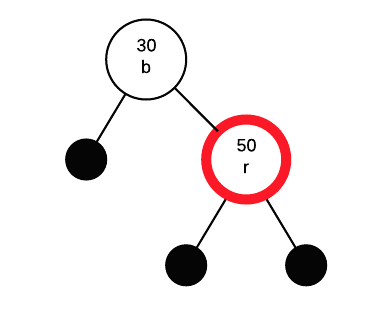
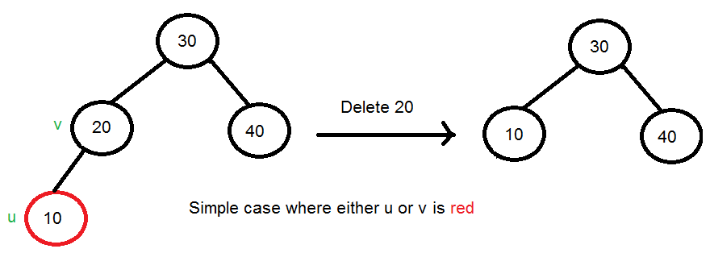
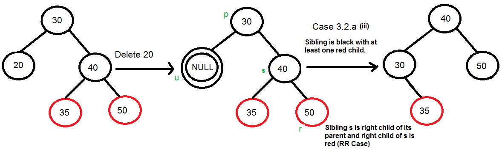

# Research Paper
* Name: Jiawei Zhou
* Semester: Summer 2023
* Topic: Red–black tree
* Link The Repository: https://github.com/jwzhou1/FinalResearchPaper.git


## Introduction
- Provide an introduction to the rest of the paper. 

In the domain of computer science, the significance of data structures cannot be overstated when it comes to effectively organizing and managing extensive volumes of data. Within the wide spectrum of available data structures, Red-Black Trees emerge as a sophisticated and highly efficient solution for maintaining ordered data while guaranteeing balanced performance. In this final research paper, we will delve into the complexities of Red-Black Trees, their role in addressing fundamental problems, and embark on an intriguing journey through their historical evolution.

Red-Black Trees are a type of self-balancing binary search trees (BSTs) that offer a systematic and flexible approach to organizing data, especially in scenarios involving dynamic insertion and deletion operations. These trees enhance the standard BST structure by incorporating additional properties and operations to maintain balance, resulting in efficient and predictable runtime complexity.

The most notable characteristic of Red-Black Trees is the color assigned to each of their nodes, which can be either red or black. This color scheme plays a crucial role in achieving a balanced tree structure in terms of depth and height, thereby ensuring efficient search, insertion, and deletion operations. Through adherence to specific rules and constraints, Red-Black Trees maintain a balance that guarantees a worst-case time complexity of O(log n) for fundamental operations.

Example of a red–black tree:  


Figure 1: A red–black tree with explicit NIL leaves [1]

  

Figure 2: A red–black tree with implicit left and right docking points [1]  

Red-Black Trees are designed to address the challenge of maintaining a balanced binary search tree while accommodating dynamic updates. Although standard binary search trees offer efficient search, insertion, and deletion operations on average, their worst-case time complexity can deteriorate to O(n) when the tree becomes highly unbalanced. This imbalance typically occurs when elements are inserted or deleted in a sorted order, resulting in a skewed tree.

Red-Black Trees mitigate this issue by implementing a set of rules and operations that ensure structural balance. These trees guarantee that the longest path from the root to any leaf node is no more than twice as long as the shortest path, thus promoting a balanced and effective search tree for various applications.

The concept of Red-Black Trees emerged from the pioneering work of Rudolf Bayer, who introduced this tree structure in 1972 during his Ph.D. studies at the University of Karlsruhe, Germany. Bayer's innovative idea involved annotating nodes with color information to achieve balance, giving birth to the red-black paradigm. [2]

Building upon Bayer's initial concept, he collaborated with his colleague Volker Günter and published a seminal paper in 1978 titled "Symmetric Binary B-Trees: Data Structure and Maintenance Algorithms." This influential publication provided a comprehensive exploration of red-black trees, delving into the intricate details of maintaining the tree's balance. The paper outlined the rules for ensuring the correct coloring and structural properties of red-black trees, along with efficient algorithms for performing insertion and deletion operations.

Since their inception, Red-Black Trees have gained widespread recognition and adoption within the realms of computer science and software engineering. They have become integral components of numerous programming languages and libraries, serving as the fundamental building blocks for various essential operations such as associative arrays, ordered sets, and dictionaries.

Red-Black Trees, as a foundational data structure in computer science, offer an elegant and efficient solution to the challenge of maintaining balanced binary search trees. By employing a clever color-coding scheme and adhering to specific rules, these trees provide fast search, insertion, and deletion operations. They exhibit a guaranteed worst-case time complexity of O(log n), ensuring reliable performance even for large datasets. The historical significance of Red-Black Trees, stemming from the groundbreaking work of Rudolf Bayer and Volker Günter, has solidified their position as a cornerstone in the field of algorithms and data structures.

Through their balanced efficiency, Red-Black Trees continue to empower developers in effectively managing and organizing data for a wide range of applications. Their elegant design and practicality have made them an indispensable tool for efficient and reliable data storage and retrieval. As the field of computer science advances, Red-Black Trees maintain their relevance and remain a crucial resource for optimizing algorithmic performance and data management in various domains.  

In this comprehensive study, we embark on an exploration to gain a deep understanding of Red-Black Trees, uncovering their construction, maintenance, and the theoretical principles that underpin their exceptional properties. Our investigation will extensively cover balancing algorithms and intricacies like color propagation, essential for comprehending how these trees maintain their balance.

The objectives of this research are diverse. Our primary aim is to provide readers with a comprehensive understanding of the fundamental principles and unique characteristics that distinguish Red-Black Trees from other balanced binary search trees. We will thoroughly examine the rules governing their construction and explore how the insertion and deletion processes dynamically adapt to maintain balance.

As part of our investigation, we will conduct a comparative analysis of Red-Black Trees against other balancing techniques, critically assessing their strengths and weaknesses. By contrasting them with alternatives such as AVL Trees, B-Trees, and Splay Trees, our study aims to offer valuable insights to aid readers in selecting the most suitable data structure for specific use cases.

In conclusion, this study seeks to be a comprehensive and informative resource for students, researchers, and professionals keen on exploring the elegance and efficiency of Red-Black Trees. By grasping the inner workings of these trees, we can leverage their power to develop faster, more reliable algorithms and applications that will undoubtedly shape the future of computer science and software engineering.


## Analysis of Algorithm/Datastructure
A Red-Black Tree is a type of self-balancing binary search tree that ensures the tree remains approximately balanced during insertions and deletions. It achieves this balance through a set of rules and operations that maintain certain properties of the tree. These properties include [3]:

1. The tree is a self-balancing Binary Search Tree, which means it automatically maintains balance through rotations or node recoloring.

2. This tree data structure goes by the name "Red-Black tree" since each node is either Red or Black. A unique bit is used to represent the color of each node - 0 for black and 1 for red. Apart from this, nodes in the tree store typical binary tree information like data, left pointer, and right pointer.

3. The root node of the Red-Black tree is always colored black.

4. Unlike regular binary trees where leaf nodes have no children, in the Red-Black tree, nodes without children are considered internal nodes. These internal nodes are connected to special NIL nodes, which are always colored black, and these NIL nodes act as the leaf nodes in the Red-Black tree.

5. A crucial property of the Red-Black tree is that if a node is colored red, then its children must be colored black. Essentially, there are no red-red parent-child relationships allowed.

6. Another important property of the Red-Black tree is that every path from a node to any of its descendant NIL nodes should have the same number of black nodes. This ensures that the tree remains balanced and guarantees logarithmic height.

While every AVL tree can be transformed into a Red-Black tree by assigning each node a color, it's important to note that not every Red-Black tree can be considered an AVL tree. The reason for this distinction lies in their respective balancing properties. AVL trees adhere to strict height-balance conditions, ensuring that the height difference between the left and right subtrees of any node is no more than one. On the other hand, Red-Black trees, while self-balancing, do not enforce complete height-balance and may have a greater height difference between subtrees. As a result, a Red-Black tree might not meet the criteria to be classified as an AVL tree.

Let's begin with a comprehensive overview of the time and space complexity of Red-Black Tree operations[4]:
| OPERATION | AVERAGE CASE | WORST CASE |
|-----------|--------------|------------|
| Space     | $O(n)$       | $O(n)$     |
| Search    | $O(log n)$   | $O(log n)$ |
| Insert    | $O(log n)$   | $O(log n)$ |
| Delete    | $O(log n)$   | $O(log n)$ |


**Search in Red-Black tree**

A Red-Black tree takes O(log n) time for search because it is a type of self-balancing binary search tree. The Red-Black tree maintains its balance by enforcing certain properties that ensure its height remains logarithmic with respect to the number of nodes (n) in the tree.

Because of properties of red-black trees, the longest path from the root to any leaf node cannot be more than twice the length of the shortest path from the root to any leaf node. This guarantees that the tree is balanced, and the height of the tree remains logarithmic with respect to the number of nodes (O(log n)).

As a result, the search operation in a Red-Black tree takes O(log n) time complexity, which is very efficient for large datasets, making it a preferred data structure for various applications.

Since the Red-Black tree is a type of binary search tree, the search operation in a Red-Black tree is analogous to the search operation in a binary search tree.

To better grasp the search operation in a Red-Black tree, let's consider the below binary search tree from Javatpoint.com [3]:


In the above tree, if we want to search for the value 80, the search process proceeds as follows:

1. We start by comparing 80 with the root node, which is 10. Since 80 is greater than 10, we continue the search on the right subtree.
2. Next, we compare 80 with the node 15. As 80 is greater than 15, we move to the right child of 15, which is 20.
3. We reach the leaf node 20, but since 20 is not equal to 80, the search concludes, indicating that the element 80 is not found in the tree.

Throughout each step of the search operation, the tree effectively divides in half. As a result, the Binary Search Tree (BST) structure enables the search to take O(log n) time complexity, making it an efficient search operation for balanced trees like the one shown above.


**Insertion in Red-Black tree**

A Red-Black tree takes O(log n) time for insertion because it is designed as a self-balancing binary search tree. The Red-Black tree maintains its balanced structure through a series of color adjustments and rotations during the insertion process.

When inserting a new node into the Red-Black tree, it starts as an ordinary binary search tree insertion. The new node is initially colored as red to preserve the other properties of the Red-Black tree. Once the node is inserted, a series of color adjustments and rotations are performed to restore and maintain the Red-Black tree properties.

Firstly, below are the rules used to construct a Red-Black tree [3]:

1. If the tree is empty, a new node is created as the root node with a black color.
2. If the tree is not empty, a new node is added as a leaf node with a red color.
3. If the parent of a new node is black, no further adjustments are needed, and the insertion process exits.
4. If the parent of a new node is red, the color of the parent's sibling is checked:  
   a. If the sibling's color is black, rotations and recoloring are performed to maintain the Red-Black tree properties.  
   b. If the sibling's color is red, the node is recolored. Additionally, if the parent's parent of the new node is not the root node, the process is repeated by recoloring and rechecking the node until the Red-Black tree properties are satisfied.

Let's explore the insertion process in the Red-Black tree using the following elements from javatpoint.com [3]:

**10, 18, 7, 15, 16, 30, 25**

**Step 1:** At the beginning, the tree is empty, and we introduce a new node with a value of 10. Since this is the first node in the tree, it becomes the root node. As mentioned earlier, the root node must always be colored black, as illustrated below:


**Step 2:** The subsequent node is 18. Since 18 is greater than 10, it will be placed to the right of 10, as demonstrated below:


Following the second rule of the Red-Black tree, when the tree is not empty, the newly created node will have the color Red. Therefore, node 18 is given the Red color.

Next, we proceed to check the third rule of the Red-Black tree, which requires that the parent of the new node must be black. In the previous figure, it can be observed that the parent of node 18 is indeed black, thereby confirming that the tree maintains the properties of a valid Red-Black tree.  

**Step 3:** Moving forward, we introduce a new node with a value of 7 and assign it the color Red. Since 7 is less than 10, it is placed to the left of node 10, as illustrated below:


Now, let's proceed to validate the third rule of the Red-Black tree, which ensures that the parent of the new node is black. Upon observation, we can confirm that the parent of node 7 is indeed black in color, thus adhering to the properties of the Red-Black tree.

**Step 4:** Moving on to the next element, which is 15, we find that it is greater than 10 but less than 18. Consequently, a new node is created to the left of node 18. As per the Red-Black tree rules, the node 15 will be colored Red since the tree is not empty.

The preceding tree exhibits a violation of the Red-Black tree property due to the presence of a Red-red parent-child relationship. To rectify this, we need to apply specific rules to maintain a valid Red-Black tree structure.

Rule 4 of Red-Black trees states that if the new node's parent is Red, we must examine the color of the parent's sibling node. In this case, the new node is node 15, its parent is node 18, and the sibling of the parent node is node 7. Since the color of the parent's sibling (node 7) is Red, we apply Rule 4a. According to Rule 4a, we need to recolor both the parent and the parent's sibling node. Consequently, both nodes 7 and 18 will be recolored, resulting in the updated figure below:


Another crucial check we need to perform is whether the parent's parent of the new node is the root node or not. Upon observation in the above figure, it is evident that the parent's parent of the new node (node 15) is indeed the root node (node 10). As a result, there is no need to recolor the root node in this scenario.

**Step 5:** Proceeding with the next element, which is 16, we observe that it is greater than 10, but less than 18 and greater than 15. Consequently, node 16 will be placed to the right of node 15. As the tree is not empty, node 16 will be colored Red.


In the previous figure, it is evident that a violation of the parent-child relationship exists due to the presence of a red-red parent-child relationship. To address this issue and create a valid Red-Black tree, we need to apply certain rules. Since the new node's parent is red and the parent has no sibling, we will apply rule 4a, which involves performing rotations and recoloring on the tree.

As node 16 is to the right of node 15, and the parent of node 15 is node 18, we encounter an LR (Left-Right) relationship, which requires two rotations. Initially, a left rotation is performed on nodes 15 and 16, resulting in node 16 moving upward, and node 15 moving downward. The tree after the left rotation appears as shown below:  


In the previous figure, we can observe that there exists an LL (Left-Left) relationship. Due to the Red-red conflict in the tree, we need to perform a right rotation to resolve it. After executing the right rotation, the median element, which is node 16, will become the root node. Consequently, nodes 15 and 18 will be placed as the left child and right child, respectively, as illustrated in the following figure:


Following the rotation, both node 16 and node 18 will undergo recoloring. Node 16, which is currently red, will change to black, while node 18, which is black, will change to red. The resulting tree structure is illustrated in the figure below:


**Step 6:** Moving forward, the next element to insert is 30. Node 30 will be added to the right of node 18. Since the tree is not empty, the color of node 30 will be red.


The new node's parent and its parent's sibling are both initially Red in color, leading to the application of rule 4b. Rule 4b solely involves recoloring without any need for rotations. Consequently, both the parent (node 18) and its sibling (node 15) change their color to black, as depicted in the image below.


Additionally, we need to verify the status of the parent's parent of the new node to determine if it is the root node. In this case, the parent's parent of the new node (node 30) is node 16, and node 16 is not the root node. Consequently, we will reassign the color of node 16 to Red. The parent of node 16 is node 10, and it is not Red in color, thus ensuring there is no Red-red conflict in the tree structure.


**Step 7:** Let's now insert the next element, 25, into the tree. Considering the values of existing nodes, we find that 25 falls between 10, 16, 18, and 30. Therefore, it will be placed to the left of node 30. Since the tree is not empty, we'll mark node 25 as Red.

Here comes the tricky part, a Red-red conflict arises since the parent of the newly inserted node is also Red.

To resolve this, we apply rule 4a, which involves both rotation and recoloring. Since there's no parent's sibling in this scenario, we proceed with the rotations first.

Given that the newly inserted node is on the left of its parent, and the parent node is on the right of its parent, a "RL" relationship is formed. As a result, we perform a right rotation, which moves node 25 upwards, while node 30 goes downwards. The figure below illustrates this transformation.


Following the initial rotation, an RR relationship is established, prompting a subsequent left rotation. As a result of the right rotation, the central element, 25, assumes the position of the root node. Node 30 will be situated to the right of 25, while node 18 will find its place on the left side of node 25.


Now, we proceed with the recoloring step. Nodes 25, 18 and 15 will undergo recoloring. Specifically, node 25 and 15 will change its color to black, while node 18 will assume a red color.


The tree depicted above adheres to all the properties of a Red-Black tree, making it a valid Red-Black tree. This example has been sourced from javatpoint.com [3].

Let's explore another insertion example in the Red-Black tree using the following elements from catherine-leung.gitbook [3]:

**30 50 40 20 10**

Let's start with an empty tree. The images presented below represent null nodes (empty subtrees), which are indicated by black circles.


We will now insert the node with a value of 30 into the red-black tree. During the insertion process, all nodes are initially added as red nodes.


When inserting a node into the red-black tree, if the root node turns out to be red, we need to change its color to black to satisfy the red-black tree properties.


Let's proceed with the insertion of a node with a value of 50 into the red-black tree. Since the parent node is black, we can directly insert the new node as a red node without making any further adjustments.



We will now insert a node with a value of 40 into the red-black tree. This new node will be inserted as a red node.


We have two red nodes in a row in the red-black tree. Let's identify the nodes involved:

- P (Parent - Upper red) = 50
- C (Child - Lower red) = 40
- G (Grandparent) = 30
- PS (Parent's Sibling) = Null node to the left of 30

Since the parent's sibling (PS) is black, we need to fix this by performing a rotation. The type of rotation required depends on the configuration of G, P, and C. If the path from G to C is straight (both left or both right), we perform a zigzag (single) rotation. If it is angled (left then right or right then left), we need to do a zigzag (double) rotation.


In this particular scenario, we must perform a zigzag (double) rotation. Let's start by rotating nodes 40 and 50.


After the initial zigzag (double) rotation with nodes 40 and 50, we need to perform another rotation, this time involving nodes 30 and 40. During this rotation, we will also swap the colors of nodes 30 and 40. The zigzag rotation is an additional step that ensures the insertion path follows the same direction.


Once the rotations are completed, we proceed to exchange the colors between the node that has taken over G's spot (40 in this case) and G (30). Consequently, node 40 will become black, and node 30 will become red. This color exchange ensures that the red-black tree properties are maintained after the insertion process.


Let's insert a new node with a value of 20 into the red-black tree. This node will be inserted as a red node, and we will proceed with the necessary adjustments to maintain the red-black tree properties.


We have two red nodes in a row in the red-black tree. Let's identify the nodes involved:

- P (Parent - Upper red) = 30
- C (Child - Lower red) = 20
- G (Grandparent) = 40
- PS (Parent's Sibling) = Null node to the left of 50

Since the parent's sibling (PS) is red, we need to perform an operation called color exchange. We exchange colors between G and its two children (P and PS) to satisfy the red-black tree properties.


Performing the color exchange in this case violates properties of red-black trees, which states that roots must be black. To rectify this, we simply change the color of the root node (G, which is currently 40) to black. This adjustment ensures that all red-black tree properties are upheld without causing any further issues.


Let's insert a new node with a value of 10 into the red-black tree. This node will be inserted as a red node, and we will proceed with the necessary adjustments to maintain the red-black tree properties.


We have two red nodes in a row in the red-black tree. Let's identify the nodes involved:

- P (Parent - Upper red) = 20
- C (Child - Lower red) = 10
- G (Grandparent) = 30
- PS (Parent's Sibling) = Null node to the right of 30

Since the parent's sibling (PS) is black (null nodes are considered black in red-black trees), we need to fix this by performing a rotation. The rotation will always be done with G (30) as the root of the rotation (the A in the rotation diagram).

This time, the path from G to P to C is "left" then "left," so we only need to perform a single rotation. After the rotation, we will swap the colors between G (30) and the node that took G's spot. This adjustment ensures that the red-black tree properties are maintained after the insertion process.


After completing the necessary adjustments and rotations, the final red-black tree structure will look like this:


**Deletion in Red-Black tree**  

A Red-Black tree takes O(log n) time for deletion because it is a self-balancing binary search tree that maintains its balanced structure during the deletion process. When a node is deleted from the Red-Black tree, a series of color adjustments and rotations are performed to restore and preserve the Red-Black tree properties.

The deletion process in a Red-Black tree begins with a standard binary search tree deletion. Once the node is removed from the tree, the tree's properties may be violated, specifically the properties related to color balance and black height. To maintain these properties, a set of restructuring operations, including color adjustments and rotations, are performed.

Now, let's explore the process of deleting a specific node from the Red-Black tree. We will be employing the following steps to achieve the deletion from GeeksforGeeks [6]:

**1.** To delete a node in the Red-Black Tree, we first perform the standard Binary Search Tree (BST) delete operation. This operation results in the deletion of a node that is either a leaf or has only one child. In the case of an internal node, we copy the successor and then recursively call the delete function for the successor. It is important to note that the successor node is always a leaf node or a node with one child. Let's assume that we want to delete node v, and u represents the child that will replace v. If v is a leaf node, then u is set to NULL (considered as Black in terms of color representation).

**2.** In the simple case where either u or v is red, we mark the replaced child as black. This operation does not affect the black height of the tree. It is worth mentioning that both u and v cannot be red simultaneously, as u is the child of v, and having two consecutive red nodes is not permitted in a Red-Black Tree.



**3.** When both u and v are Black:  
**3.1** We color u as "double black." This means that after the standard delete operation in a Red-Black Tree, u takes on the double black color. Our goal now is to convert this double black node back to a single black node, maintaining the Red-Black Tree properties. It is important to mention that if v is a leaf node, then u is set to NULL, and in terms of color representation, NULL is considered to be black. Hence, the deletion of a black leaf node also results in a double black situation.


**3.2** While the current node u is in a double black state and is not the root, the following steps are taken. Let the sibling of the node u be denoted as s.

(a) **If the sibling s is black and at least one of its children is red**, a rotation is performed on s. Let the red child of s be denoted as r. This case can be further divided into four subcases, based on the positions of s and r.

   i. Left-Left Case: In this scenario, s is the left child of its parent, and r is the left child of s, or both children of s are red. This subcase can be visualized as a mirror image of the right-right case.

   ii. Left-Right Case: Here, s is the left child of its parent, and r is the right child of s. This subcase can be envisioned as a mirror image of the right-left case.

   iii. Right-Right Case: In this situation, s is the right child of its parent, and r is the right child of s, or both children of s are red.

   
   
   iv. Right-Left Case: In this scenario, the sibling s is the right child of its parent, and r is the left child of s.

   

(b) If the sibling s is black and both of its children are black, a recoloring is performed, and the process is recursively applied to the parent node if the parent is black.

   

   
   In this case, if the parent was red, there would be no need to recur for the parent; instead, we can simply change its color to black, as combining red and double black results in a single black node.

(c) If the sibling s is red, a rotation is performed to move the old sibling up, followed by recoloring the old sibling and the parent. As a result of this operation, the new sibling becomes black. This transformation mainly converts the tree to a situation with a black sibling (achieved through rotation) and then leads to either case (a) or case (b). This case can be further divided into two subcases:

   i. Left Case: When s is the left child of its parent, a right rotation is applied to the parent node p.

   ii. Right Case: If s is the right child of its parent, a left rotation is performed on the parent node p.

   

   
**3.3** If u is the root, we simply make it a single black node, reducing the black height of the complete tree by 1.


## Empirical Analysis
- What is the empirical analysis?
- Provide specific examples / data.


## Application

Now let's explore various fields and areas where red-black trees are commonly used and why they are preferred for those specific applications:

1. **Dynamic Set Operations:**
   One of the primary applications of red-black trees is to implement dynamic set operations[7], such as searching, insertion, and deletion of elements while maintaining a balanced data structure. The self-balancing property of red-black trees ensures that these operations take O(log n) time, making them efficient for dynamic data sets with frequent updates.

   **Example:** A spell-checker application can use a red-black tree to store a dictionary of words, allowing quick word lookups, insertions of new words, and removal of incorrect words while ensuring the dictionary remains sorted for efficient search operations.

2. **Compiler and Symbol Table:**
   Red-black trees are widely used in compilers and interpreters to build and maintain symbol tables efficiently[8]. A symbol table is a data structure that stores information about variables, functions, and other symbols used in a program. The balanced nature of red-black trees makes them ideal for implementing symbol tables, as they offer efficient insertion and retrieval of symbols.

   **Example:** In a programming language compiler, red-black trees can be used to store the symbols encountered during the parsing phase, allowing the compiler to quickly look up and update symbol information during later stages of compilation.

3. **Operating Systems:**
   Red-black trees find applications in various operating system components, such as process scheduling, file system management, and memory management[9]. They are used to organize and maintain data structures that require fast search and insertion operations while ensuring balanced resource allocation.

   **Example:** In process scheduling, a red-black tree can be utilized to maintain a ready queue of processes, where the nodes represent processes with their respective priorities. The scheduler can quickly find the process with the highest priority, allowing for efficient context switching.

4. **Interval Trees:**
   An interval tree is a specialized form of a red-black tree that stores intervals of values and is used in applications that involve searching for overlapping or intersecting intervals efficiently[10]. Interval trees allow efficient range queries, insertion, and deletion operations.

   **Example:** In a calendar application, an interval tree can be used to store and manage events. The intervals represent the start and end times of events, allowing the application to find overlapping events or retrieve events within a specific time range quickly.

5. **Database Indexing:**
   In databases, red-black trees are often used to implement balanced search trees for indexing[11]. Indexes speed up query processing by allowing rapid data retrieval based on specific attributes or fields, and red-black trees efficiently handle insertions and deletions to maintain the index's balance.

   **Example:** In a relational database management system, a red-black tree index can be used to accelerate search operations on a specific column, reducing the time needed for retrieving relevant rows from large tables.

6. **Network Routing Algorithms:**
   Red-black trees can be applied in network routing algorithms, where they are used to organize and maintain routing information efficiently[12]. The balanced nature of red-black trees ensures that routing tables can be updated and queried quickly.

   **Example:** In computer networks, red-black trees can be used in link-state routing protocols like OSPF (Open Shortest Path First) to maintain and manage the network's topology information. The trees can store and update routing table entries, which are essential for packet forwarding decisions.

7. **Counting and Ranking Operations:**
   Red-black trees can be augmented to support counting and ranking operations on a dynamic set of elements[13]. Augmentation involves adding extra information to each node, enabling efficient counting or ranking queries.

   **Example:** An e-commerce platform can use an augmented red-black tree to maintain the list of products sorted by their popularity or sales count. The tree's augmentation allows the platform to quickly determine the most popular products or provide ranked product lists to users.

   Let's now delve into the benefits and drawbacks of the red-black tree data structure.

   **Advantages of Red-Black Tree:**  
   1. Balancing: Red-black trees maintain a balanced parallel tree, which ensures efficient operations and prevents the tree from becoming skewed.
   2. Efficient Search: The time complexity for search operations is O(log n), making it fast and suitable for large datasets.
   3. Low Constants: Red-black trees have relatively low constants in a wide range of scenarios, leading to efficient performance in practical use cases.
   4. Dynamic Nature: They support dynamic operations like insertion and deletion efficiently while maintaining the balanced property.
   5. Ease of Implementation: Red-black trees are relatively easy to understand and implement, making them accessible for developers.
   6. Flexibility: Suitable for various applications, including database indexing, memory management, and network routing. They handle ordered and unordered data effectively, making them versatile for different data structures.

   **Disadvantages of Red-Black Tree:**  
   1. Complexity: Managing edge cases and implementing a red-black tree from scratch can be complex, and using standard library implementations is often preferred.
   2. Performance: For scenarios where the tree is built once and only read operations are performed, AVL trees may offer better performance.
   3. Not Ideal for Disk Storage: B-trees are preferred for storing large amounts of data on disks due to their ability to limit disk operations.
   4. Inefficient Concurrent Access: Locking red-black trees perform poorly with simultaneous access compared to locking skip lists, which offer better concurrent performance.
   5. Scalability: As the number of nodes in the tree increases, managing a red-black tree can become challenging and impact performance.
   6. Slow Insertions: Insertions in red-black trees can be relatively slow compared to other data structures like AVL trees.
   7. Not Suitable for Large Datasets: Red-black trees may not be the best choice for handling large datasets efficiently.
   8. Overhead: The self-balancing nature of red-black trees adds overhead to insertion and deletion operations, making them slightly slower compared to non-self-balancing structures.
   9. Worst-case Performance: While red-black trees have good average-case performance, their worst-case performance can be slow compared to other data structures.


## Implementation
- What language did you use?
- What libraries did you use?
- What were the challenges you faced?
- Provide key points of the algorithm/datastructure implementation, discuss the code.
- If you found code in another language, and then implemented in your own language that is fine - but make sure to document that.

I will implement the Red-Black Tree by using Python. First of all, let's explore the pseudocode for the implementation of Red-Black trees.

The first operation is insertion, which involves adding a new node to a tree. This is accomplished using the insert method with the following algorithm based on CLRS[14] pseudocode for RB-Insert:

```
   RB-Insert(T,z)
      y = nil[T]
      x = root[T]
      while x != nil[T]
            y = x
            if key[z] < key[x] then
               x = left[x]
            else
               x = right[x]
      p[z] = y
      if y = nil[T]
            root[T] = z
      else
         if key[z] < key[y] then
            left[y] = z
         else
            right[y] = z
      left[z] = nil[T]
      right[z] = nil[T]
      color[z] = RED
      RB-Insert-fixup(T,z)

   Parameters:
   value - is an integer to be inserted
```

Next, we have the leftRotate() operation, which is responsible for performing a single left rotation. Typically, this method would be marked as private since it serves as a helper function. It follows the algorithm CLRS [14] as described below:

```
 pseudocode for left rotations
 pre: right[x] != nil[T]
 pre: root's parent is nill[T]

 Left-Rotate(T,x)
    y = right[x]
    right[x] = left[y]
    p[left[y]] = x
    p[y] = p[x]


    if p[x] == nil[T] then root[T] = y
    else
       if x == left[p[x]] then left[p[x]] = y
       else
          right[p[x]] = y
    left[y] = x
    p[x] = y
```

Following the left rotation operation, we also have the rightRotate() operation, responsible for performing a single right rotation. Like the previous method, this one is typically marked as private since it serves as a helper function. The algorithm for the rightRotate() method, based on CLRS [14], is as follows:

```
 pseudocode for right rotation
 pre: left[x] != nil[T]
 pre: root's parent is nill[T]
 Right-Rotate(T,x)
    y = left[x]           // y now points to node to left of x
    left[x] = right[y]    // y's right subtree becomes x's left subtree
    p[right[y]] = x       // right subtree of y gets a new parent
    p[y] = p[x]           // y's parent is now x's parent

    // if x is at root then y becomes new root
    if p[x] == nil[T] then root[T] = y
    else
        // if x is a left child then adjust x's parent's left child or...

         if x == left[p[x]] then left[p[x]] = y
         else
         // adjust x's parent's right child
            right[p[x]] = y
    // the right child of y is now x
    right[y] = x
    // the parent of x is now y
    p[x] = y
 ```

Next, we will have the RBInsertFixup method. It is responsible for ensuring that the Red-Black Properties of the tree are preserved after performing an insertion. Typically, this method would be marked as private since it serves as a helper function. I will follow Andrew's pseudocode [15] which will provide two pseudocode descriptions: the first one is more for understanding, while the second one is closer to an implementation.

```
  RB-Insert-fixup(T,z) {
  while(z's parent is Red) {
      set y to be z's uncle
      if uncle y is Red {
               color parent and uncle black
               color grandparent red
               set z to grandparent
      }
      else {  // the uncle is black
              if (zig zag) { // make it a zig zig
                             set z to parent
                             rotate to zig zig
                           }
              // rotate the zig zig and finish
              color parent of z black
              color grandparent of z red
              rotate grand parent of z
           }
   } // end while
  color root black
 }

  Low-level Pseudo-code for RB-Insert-fixup
  RB-Insert-fixup(T,z)
  while color[p[z]] = RED {
    if p[z] == left[p[p[z]]] {
         y = right[p[p[z]]]
         if color[y] = RED {
             color[p[z]] = BLACK
             color[y] = BLACK
             color[p[p[z]]] = RED
             z = p[p[z]]
         }
         else {
             if z = right[p[z]] {
                  z = p[z]
                  LEFT-Rotate(T,z)
             }
             color[p[z]] = BLACK
             color[p[p[z]]] = RED
             RIGHT-Rotate(T,p[p[z]])
         }
    }
    else {
         y = left[p[p[z]]]
         if color[y] = RED {
             color[p[z]] = BLACK
             color[y] = BLACK
             color[p[p[z]]] = RED
             z = p[p[z]]
         }
         else
             {
             if z = left[p[z]] {
                  z = p[z]
                  RIGHT-Rotate(T,z)
             }
             color[p[z]] = BLACK
             color[p[p[z]]] = RED
             LEFT-Rotate(T,p[p[z]])
         }
    }
    color[root[T]] = BLACK
  }
  
Parameters:
z - is the new node
```


## Summary
- Provide a summary of your findings
- What did you learn?

## Reference
[1] Red-black tree. In Wikipedia. Retrieved July 15, 2023, from https://en.wikipedia.org/wiki/Red%E2%80%93black_tree   
[2] Huja, H. Red-Black Tree. Medium. Retrieved July 15, 2023, from https://hardikahuja99.medium.com/red-black-tree-8cf904034a90  
[3] JavaTpoint. Red-Black Tree. Retrieved July 15, 2023, from https://www.javatpoint.com/red-black-tree  
[4] OpenGenus IQ. Time and Space Complexity of Red-Black Tree. Retrieved July 15, 2023, from https://iq.opengenus.org/time-and-space-complexity-of-red-black-tree/  
[5] Leung, C. Red-Black Trees. In Data Structures and Algorithms: A Comprehensive Guide. Retrieved July 15, 2023, from https://catherine-leung.gitbook.io/data-strutures-and-algorithms/red-black-trees  
[6] GeeksforGeeks. Deletion in Red-Black Tree. GeeksforGeeks. Retrieved July 15, 2023, from https://www.geeksforgeeks.org/deletion-in-red-black-tree/  
[7] Li, C. (2021, September 15). Algorithms and Data Structures - Chapter 14. University of Science and Technology of China. http://staff.ustc.edu.cn/~csli/graduate/algorithms/book6/chap14.htm  
[8] Sanjiv, K. Search Algorithms. Retrieved July 15, 2023, from http://www.cs.umsl.edu/~sanjiv/classes/cs3130/lectures/search1.pdf  
[9] Coding Ninjas. Introduction to Red-Black Trees. Coding Ninjas Studio. Retrieved July 15, 2023, from https://www.codingninjas.com/studio/library/introduction-to-red-black-trees  
[10] Borzoo Esmailloo. (2020, May 3). Augmenting Red-Black Trees. Medium. Retrieved July 15, 2023, from https://medium.com/swlh/augmenting-red-black-trees-d9b4cd7635f8  
[11] Baeldung. Red-Black Trees and Their Applications. Baeldung. Retrieved July 15, 2023, from https://www.baeldung.com/cs/red-black-trees-applications  
[12] GeeksforGeeks. Applications, Advantages, and Disadvantages of Red-Black Tree. GeeksforGeeks. Retrieved July 15, 2023, from https://www.geeksforgeeks.org/applications-advantages-and-disadvantages-of-red-black-tree/  
[13] Byorgey, B. Counting Inversions via Rank Queries. Brent's Blog. Retrieved July 15, 2023, from https://byorgey.wordpress.com/2019/12/18/counting-inversions-via-rank-queries/  
[14] Thomas H. Cormen, Charles E. Leiserson, Ronald L. Rivest, and Clifford Stein. 2009. Introduction to Algorithms, Third Edition (3rd. ed.). The MIT Press.  
[15] Andrew Carnegie Mellon University. RedBlackTree. JavaDocs. Carnegie Mellon University. https://www.andrew.cmu.edu/user/mm6/95-771/examples/RedBlackTreeProject/dist/javadoc/redblacktreeproject/RedBlackTree.html#inOrderTraversal(redblacktreeproject.RedBlackNode)  